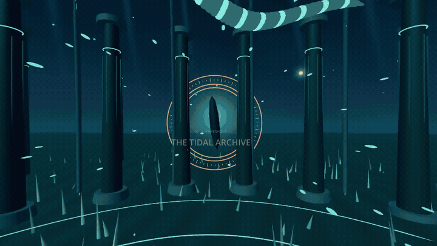

# Godot360 Studio

**Turn your Godot 3D scene into a 360° video, from the editor.**
Choose a camera, test a second, and export an MP4 with sound that viewers can look
around in. Use it for animated worlds, immersive films, and camera walkthroughs.

*Made with Godot360: **THRESHOLD**, a 60-second film rendered at 8K with original
stereo music. This silent GIF shows four short, flat views of the 360° output.*
**[Watch / download the film with sound · 60 s, 6 MB](docs/media/threshold-tour.mp4)**
· [Still-image gallery](docs/showcase.md#four-worlds-one-film)
· [How the film was made](docs/threshold.md)

**[Export your first scene →](addons/godot360/QUICKSTART.md)**
· [Take the visual tour](docs/showcase.md)
· [Browse the documentation](docs/README.md)

## From your scene to a video people can explore

**Godot scene + Camera3D → Test 1 second → Render 360 video → Look around and listen**

You author the camera's position, movement and sequence. The viewer chooses where
to look during playback. The exported film follows the same timeline for everyone;
prepare interactive gameplay or gaze events as an authored sequence for capture.

*The current panel, captured in an isolated Godot project. Left: scene, camera,
quality and sound. Right: draggable spherical review, seeking and playback audio.
The editor review copy is limited to 2K / 30 FPS; the delivery keeps your chosen resolution.*

| What you can do | How it helps |
| --- | --- |
| Export mono 360° at **2K, 4K or 8K** | Choose a quick draft or a detailed delivery; 24, 25, 30, 50 and 60 FPS presets are available. |
| Capture scene audio, attach music, or mix both | Set timing and levels alongside the video recipe. |
| **Test 1 second** before a full render | Inspect a real sample and get measured time/storage estimates. |
| Review a complete clip inside Godot | Drag to look around, play, pause, seek and listen. |
| Reopen **Recent exports** and recover jobs | Return to saved work, inspect its state and reuse completed captures. |
| Re-encode retained frames | Change compression or audio without rendering the scene again. |
| Produce a verified delivery MP4 | Encoding, spherical metadata and technical checks run as part of the export. |

## Try it in your project

You need **Godot 4.7.2 Standard**, **FFmpeg** and **FFprobe**. Keep your project's
renderer. Follow [platform setup](addons/godot360/PLATFORMS.md) to install the tools;
the addon itself needs no .NET runtime, compiler, Python or Godot export templates.

1. Copy `addons/godot360` beside your `project.godot`. Enable **Godot360 Studio**
   under **Project > Project Settings > Plugins**, then open the **Godot360** bottom panel.
2. Under **Tool setup**, click **Find installed tools**, or select FFmpeg and FFprobe.
3. Click **Use current scene**, choose a **Camera**, and set quality, duration,
   audio and an output folder. Save a new scene before selecting it.
4. Click **Check setup**, then **Test 1 second**. Inspect the sample and its estimates.
5. Click **Render 360 video**. Use **Play video** to review it and **Open output**
   to find the verified `video-360.mp4`.

**[Step-by-step quick start and troubleshooting →](addons/godot360/QUICKSTART.md)**

## Try the included examples

Godot360 Studio is the tool; **UMBRAL** and **THRESHOLD** are examples made with it.
Open this repository's `project.godot` to try them; the plugin is already enabled.

| Example | See what it does | Open it |
| --- | --- | --- |
| **THRESHOLD** | [Four procedural worlds, moving scenery and an original score](docs/showcase.md#four-worlds-one-film) | `scenes/films/Threshold.tscn` → F6; load `export_profiles/threshold-8k.tres`. [Film guide](docs/threshold.md). |
| **UMBRAL** | [A small installation with gaze-driven discoveries](docs/showcase.md#an-interactive-scene-prepared-for-film) | F5 to explore; load `export_profiles/umbral-film.tres` for its authored 12-second film. [Scene guide](docs/umbral.md). |
| **Motion lab** | An editable camera path and animation timeline | Panel → Recipes and examples → **Motion lab**. [Authoring guide](addons/godot360/AUTHORING.md). |
| **Calibration** | Six labeled directions and a test tone | Panel → Recipes and examples → **Calibration defaults**. Start here to check orientation and sound. |

## Where the project stands

**Private development toward 1.0, currently on the 0.8 code baseline.**
Onboarding, rendering, playback and recent-export improvements are implemented.
Development and testing continue privately until the [1.0 completion criteria](docs/release-readiness.md)
are met; no public beta is required.

- **Windows:** tested exports and review on Godot 4.5.1, 4.6.3 and 4.7.2;
  Forward+/Mobile also have Windows Vulkan and Direct3D 12 visual evidence.
- **Linux:** export/review workflows and software OpenGL/Vulkan checks pass,
  including hosted CI. Hardware GPU validation remains open.
- **macOS:** Apple Silicon headless CI passes, including playback and recovery
  checks. Graphical export and Mac GPU validation remain open.
- **New:** optional [capture borders with before/after examples](docs/capture-borders.md)
  reduce tested glow cuts at edges and corners.
- [Particle capture checks](docs/particle-capture.md) now cover authored pauses
  and show how explicit visibility bounds fix tested CPU particle startup.
- **Next:** exposure and remaining effect seams, complex animated scenes, native hardware
  coverage, representative Forward+/Mobile endurance and private workflow review.

Scope is **mono 360°, SDR BT.709 and stereo sound**. Six-face capture can show
seams with glow, auto exposure and other screen-space effects; inspect a test
before a long export. Stereoscopic 3D, ambisonics and automatic uploads are outside
the current scope. [Renderer limits](addons/godot360/RENDERERS.md)
· [Exact validation evidence](docs/validation.md) · [Roadmap](docs/roadmap.md)

## Download the dependencies

| Platform | Godot | FFmpeg + FFprobe | Setup |
| --- | --- | --- | --- |
| Windows x86_64 | [4.7.2 Standard](https://godotengine.org/download/archive/4.7.2-stable/) | [gyan.dev release essentials ZIP](https://www.gyan.dev/ffmpeg/builds/); both tools are in `bin/` | [Windows](addons/godot360/PLATFORMS.md#windows) |
| Linux | [4.7.2 Standard](https://godotengine.org/download/archive/4.7.2-stable/) | Ubuntu/Debian: `sudo apt install ffmpeg` | [Linux](addons/godot360/PLATFORMS.md#linux) |
| macOS | [4.7.2 Standard](https://godotengine.org/download/archive/4.7.2-stable/) | [Homebrew](https://docs.brew.sh/Installation): [`brew install ffmpeg-full`](https://formulae.brew.sh/formula/ffmpeg-full) | [macOS and explicit tool paths](addons/godot360/PLATFORMS.md#macos) |

Nothing is downloaded by the addon. Tool paths stay local in
`.godot360/settings.cfg`; select them again after moving to another computer.
[VLC](https://www.videolan.org/vlc/) is optional for reviewing the full-resolution
delivery. Its [360° playback guide](https://docs.videolan.me/vlc-user/desktop/3.0/en/advanced/player/360_video.html)
explains looking around by dragging.

## Find the right guide

| I want to… | Read |
| --- | --- |
| See the results and understand 360° video | [Visual tour](docs/showcase.md) |
| Export my first scene | [Quick start](addons/godot360/QUICKSTART.md) |
| Animate a camera or prepare interactive content | [Authoring](addons/godot360/AUTHORING.md) |
| Add music or adjust synchronization | [Audio](addons/godot360/AUDIO.md) |
| Understand quality, recipes or command-line exports | [Addon reference](addons/godot360/README.md) |
| Recover an export or manage disk space | [Recovery](addons/godot360/RECOVERY.md) · [Storage](addons/godot360/STORAGE.md) |
| Review motion and sound inside Godot | [Playback](addons/godot360/PLAYBACK.md) |
| Prepare a YouTube delivery | [Production workflow](docs/youtube-360-production.md) |
| Develop or contribute | [Documentation index](docs/README.md#development-and-project-status) |

The addon is [MIT licensed](addons/godot360/LICENSE). Curated documentation previews
are included in the repository; full renders, settings and tool binaries stay
local. See [repository contents](docs/repository.md) and [media sources](docs/media/README.md).
Project code, interface text and documentation are in English.
