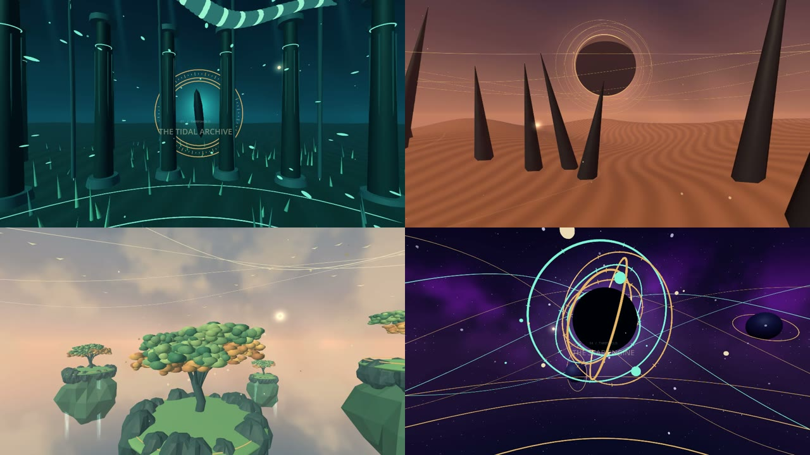

# Godot360 documentation

**Export your Godot 3D scene as a video people can look around in.** Start with
the results, then follow the walkthrough using your own scene or an included example.

**[See what it can do →](showcase.md)**
· **[Export your first scene →](../addons/godot360/QUICKSTART.md)**
· [Watch / download the example with sound](media/threshold-tour.mp4)

## Make a 360° video

| Your next step | Guide |
| --- | --- |
| Install the addon, Godot and native media tools | [Platform setup](../addons/godot360/PLATFORMS.md) |
| Select a scene, test it and render | [First export](../addons/godot360/QUICKSTART.md) |
| Animate a camera or prepare interactive events | [Authoring](../addons/godot360/AUTHORING.md) · [Skeletal camera timing](skeletal-capture.md) · [Imported characters](imported-characters.md) · [Head look and nested attachments](modifier-capture.md) · [Particle capture](particle-capture.md) · [Moving smoke](smoke-capture.md) |
| Add a soundtrack, mix audio and adjust timing | [Audio](../addons/godot360/AUDIO.md) |
| Understand quality, recipes and command-line use | [Addon reference](../addons/godot360/README.md) |
| Check glow, exposure and other scene effects | [Renderers](../addons/godot360/RENDERERS.md) · [Capture borders](capture-borders.md) · [Consistent exposure](exposure-consistency.md) · [Combined appearance](combined-appearance.md) · [Temporal effects](temporal-capture.md) · [Saved LightmapGI](lightmap-capture.md) · [Combined GI, transparency and history](combined-effects.md) |
| Play, seek and listen inside Godot | [Playback](../addons/godot360/PLAYBACK.md) |
| Reopen work, re-encode or reclaim space | [Recovery](../addons/godot360/RECOVERY.md) · [Storage](../addons/godot360/STORAGE.md) |
| Plan a larger render and final delivery | [Job planning](job-planning.md) · [Measured production budgets](production-performance.md) · [YouTube production](youtube-360-production.md) |
| Report a reproducible problem | [Contributing and issue reports](../CONTRIBUTING.md) · [Diagnostics](../addons/godot360/DIAGNOSTICS.md) |

## Explore the examples

- **[AFTERGLOW](afterglow.md):** one minute of original disco-funk, dancing glass
  tiles, swaying architecture and orbiting lights; a Forward+ 4K film and 360° player.

- **[LUMEN](lumen.md):** an orbital observatory with native light trails, soft
  vapor and an original score; a complete Forward+ 4K film and local 360° player.

- **[THRESHOLD](threshold.md):** four procedural worlds, sixty seconds, an original
  score and a complete 8K film recipe.
- **[UMBRAL](umbral.md):** a gaze-driven installation and its authored film sequence.
- **[Motion lab](../addons/godot360/AUTHORING.md):** an editable camera path and timeline.
- **Calibration:** choose **Calibration defaults** in the panel to test six directions and a tone.

## Development and project status

The source is in **pre-1.0 development**, on the 0.8 version baseline.
Start with the [remaining work and completion criteria](release-readiness.md) and
the [roadmap](roadmap.md) for completed work; use the
[validation record](validation.md) for the exact evidence behind support claims.

| Topic | Reference |
| --- | --- |
| Developer setup and verification | [Testing](testing.md) |
| Clean native editor integration | [Editor workflow](editor-workflow.md) |
| Contribution guidelines and licensing | [Contributing](../CONTRIBUTING.md) · [Third-party notices](../THIRD_PARTY_NOTICES.md) |
| Publication preparation and checks | [Publishing](publishing.md) · [Preparation review](publication-review.md) |
| Development history and continuation notes | [Handoff](HANDOFF.md) · [Engineering brief](next-session.md) |
| Historical 0.8 candidate | [Candidate record](release-0.8.md) |
| Measured performance and capture costs | [Performance](performance.md) |
| Source, local artifacts and repository policy | [Repository contents](repository.md) |
| Screenshots, previews and their regeneration | [Documentation media](media/README.md) |
| Upgrade an older addon folder | [Migration](../addons/godot360/MIGRATION.md) |

[Back to the project](../README.md)
