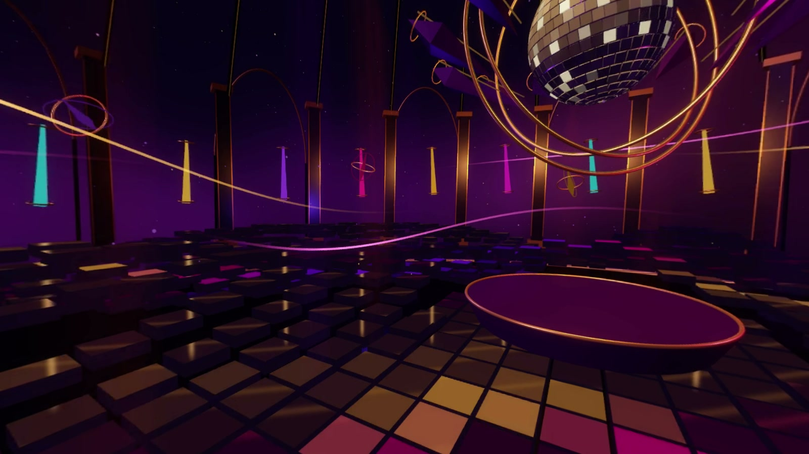

# AFTERGLOW

**A one-minute disco ritual: the bass wakes the floor, then the whole room joins in.**

[](media/afterglow-tour.mp4)

**[Watch the complete flat preview with sound](media/afterglow-tour.mp4)**

The full spherical film is generated locally at
`renders/afterglow-clearance-4k/film/video-360.mp4`; follow [Reproduce the film](#reproduce-the-film).

AFTERGLOW is a new, separate Godot360 example. An original 116 BPM disco-funk
instrumental drives a suspended mirror crown, a field of moving glass tiles,
gilded architecture, circling light ribbons and warm beams. Pillars sway with the
groove, coloured lanterns orbit and bob, and eight illuminated sculptures dance
around the viewer. The crown opens progressively, with its shards and hoops
turning on different axes. Rich pink, violet, amber and cyan accents build
against the dark room. The viewpoint rises gently while viewers choose where
to look. Its stereo score does not rotate
with viewing direction.

## The minute

| Time | Music | The room |
| --- | --- | --- |
| 0–8.28 s | Finger bass and drums establish the pocket | Coloured paths follow the actual bass notes under the glass |
| 8.28–16.55 s | Clipped guitar joins | Lanterns begin to orbit; small sculptures emerge and the pillars start swaying |
| 16.55–24.83 s | Electric piano and percussion fill out the groove | Ribbons lift and tilt around the viewer as the crown unfolds |
| 24.83–33.10 s | Strings arrive | The crystal enclosure opens wider; beams sweep and the architecture dances |
| 33.10–41.38 s | Brass calls over the full arrangement | Crown shards, hoops and orbiting sculptures answer the accents |
| 41.38–45.52 s | A two-bar breakdown | Outer tiles rise and hang while beams soften |
| 45.52–57.93 s | The ensemble returns | The crown opens fully, beams lift and the whole room moves with the groove |
| 57.93–60 s | A final Dm9 chord and decay | Light trails subside into an afterglow |



## Watch and edit

For the rendered film, run `python tools/play_afterglow.py`, then open
[the local 360 player](http://127.0.0.1:8364). Click **Step inside** to enable
sound. Drag to look around; use the seek bar, sound toggle, front-view reset,
fullscreen button or arrow keys. Space plays or pauses while the view has focus.
The player serves an explicit five-file allowlist on loopback and supports video
range requests. Its playback copy is 3072×1536; the download is 4096×2048.

For the live scene, open `scenes/films/Afterglow.tscn`. Use Forward+ for the intended
glow and lighting:

```sh
godot --path . --rendering-method forward_plus res://scenes/films/Afterglow.tscn
```

Hold the left mouse button and drag to look around. **R** restarts the music and
scene; **Escape** closes that instance. The original project's main scene remains
the default F5 experience.

Load `export_profiles/afterglow-4k.tres` in Godot360. It selects the scene, camera,
Forward+ renderer, 4K / 30 FPS, 60 seconds, 1536-pixel face cores, 12.5% capture
borders and the included soundtrack. Choose your FFmpeg/FFprobe paths, run
**Test 1 second**, then **Render 360 video**.

## Source and musical synchronization

| Component | Source |
| --- | --- |
| Room, camera, crystal, choreography and live playback | `scripts/films/afterglow.gd` |
| Glass tiles, world-space reflections, facets, beams, ribbons and dust | `assets/films/afterglow/` |
| Original arrangement and mix | `tools/compose_afterglow.py` |
| Included 48 kHz stereo soundtrack | `assets/audio/afterglow-score.wav` |
| Performed note onsets, pitches, velocities and section times | `assets/audio/afterglow-score.cues.json` |
| Musical and backward-seeking checks | `tests/afterglow_checks.gd` |
| Real GPU storyboard sampler | `tests/afterglow_storyboard.gd` |
| GPU check for tiles entering the crown pedestal | `tests/afterglow_clearance.gd` |

The score and scene use the same 116 BPM bar grid. Lights read the performed
note events, including the small timing variations in the guitar and bass.
All animated shaders use an explicit clock; scene sampling is a pure function
of film time, including backward seeks. Live preview follows audio playback time.
Capture disables live audio and attaches the same WAV during encoding.

Tile lift tapers off around the fixed crown pedestal. Clearance is measured
after sideways drift and includes the whole tile footprint, keeping the rising
floor below the pedestal wherever they overlap.

Glass reflections are authored analytic reflections of the crown and colonnade
in world coordinates. They are intentionally stylized; they are not general
scene reflections. Ribbons and dust are deterministic mesh effects. The beams
use transparent shaded geometry. Fixed exposure and capture borders help the
six rendered faces agree; this demo does not establish general support for
arbitrary reflective materials, screen-space effects or volumetric effects.

## Reproduce the film

The render helper creates an isolated project, exports through the existing
Godot360 pipeline and checks that the working project's saved settings and older
demo sources remain unchanged. Choose a fresh output folder for every render.

```sh
python tools/render_afterglow.py --godot PATH_TO_GODOT --ffmpeg PATH_TO_FFMPEG --ffprobe PATH_TO_FFPROBE --output renders/afterglow-clearance-4k
python tools/build_afterglow_media.py --ffmpeg PATH_TO_FFMPEG
python tools/play_afterglow.py
```

For a short sample from the climax, add `--seconds 2 --offset 48 --width 2048
--face-size 768` and select another output directory. The offset moves both the
scene clock and the soundtrack trim. `--prepare-only` prepares an isolated project
without rendering; the checks and storyboard script can run against that project.

The media builder produces a 900p fixed forward view of the entire minute, a
compact 720p documentation copy, the 3K player copy, stills and a contact sheet.
The documentation copy preserves the audio stream without re-encoding and stays
within the repository's 25 MiB per-file budget. It decodes all 1,800 delivery frames,
checks for blank or repeated frames and compares decoded AAC with the source WAV.
Its evidence is retained in the render folder's `media-review.json`; media hashes
are also recorded in [the documentation provenance](media/afterglow-provenance.json).

The completed Windows render used Godot 4.7.2 / Forward+ / Vulkan on an RTX 3060 Ti.
It submitted 1,802 source frames including two warmup frames, passed all 13 delivery
checks and produced a 226,585,244-byte master. The full pipeline took 617.55 seconds
and retained 8.32 GiB of render data. These are measurements on this machine.
The scene's 107 musical-clock, movement and seeking checks also pass. The media builder
requires NumPy and Pillow; playback and ordinary addon exports do not.

The clearance regression runs the production vertex shader on the GPU and checks
all 181 frames from 40 through 46 seconds against the pedestal envelope. The fixed
shader produces zero overlapping pixels; the previous shader fails this check.
Run it with Forward+ (without `--headless`) against the prepared project:

```sh
godot --path PREPARED_PROJECT --rendering-method forward_plus --script res://tests/afterglow_clearance.gd -- --output=CHECK_OUTPUT
```

The media review decoded all 1,800 frames without blank or repeated frames.
Decoded audio measured 30.08 dB SNR against the source, with a maximum measured
cue offset of one 48 kHz sample. The corrected film was checked in the local
browser for sound, seeking, dragging and playback across the repaired section;
it reported no console warnings or errors during those checks.

## Music credits and regeneration

The composition, bass phrase, guitar parts, arrangement and mix were written for
AFTERGLOW. No recordings or MIDI arrangements of existing songs are included.
Instrument samples come from **GeneralUser GS 2.0.3 by S. Christian Collins**,
rendered offline with **TinySoundFont 0.3.7**. The instrument bank's license permits
music creation; its complete text is included in
[`assets/audio/afterglow-sources/GeneralUser-GS-LICENSE.txt`](../assets/audio/afterglow-sources/GeneralUser-GS-LICENSE.txt).

The rendered WAV is included, so no synthesis dependency or download is required
to play or export the scene. To regenerate it, install NumPy and
`tinysoundfont==0.3.7`, obtain the bank from the
[GeneralUser GS project](https://github.com/mrbumpy409/GeneralUser-GS), then run:

```sh
python tools/compose_afterglow.py --soundfont PATH_TO_GENERALUSER_GS --output NEW_SCORE.wav
```

The command also writes cue and measurement JSON files. Use a fresh output path;
keep the score and cues together when replacing the included assets. The bank used
here has SHA-256 `9575028c7a1f589f5770fccc8cff2734566af40cd26ed836944e9a5152688cfe`.
The generated audio measurement file records the soundtrack hash and mix levels.

[Other examples](README.md#explore-the-examples) · [Audio controls](../addons/godot360/AUDIO.md)
