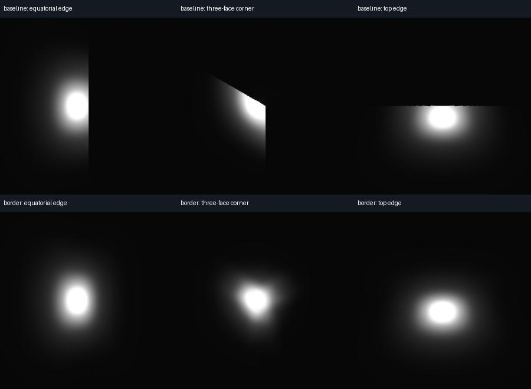
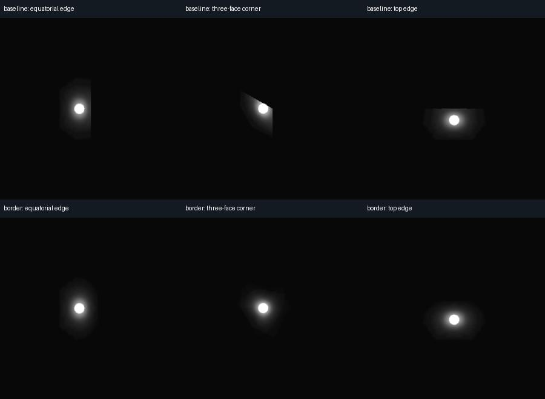

# Reducing glow cuts

**Capture borders** add scene context beyond each cube face, then blend the
overlapping views. A bright object just outside a face can contribute its halo
instead of leaving a hard cut at the face boundary.

*Actual Forward+ renders from the moving-emitter test. Each column is a normal
perspective view of the same retained frame before and after the change. The hard
cuts disappear in these views; the corner's halo still has a different shape.*

In **Advanced**, set **Capture border per edge (%)** to **12.5%**, then run a new
short test. The default **0%** keeps the original capture path. The allowed range
is 0–25%. Recipes remember the setting and re-encoding retains the captured border.

At 12.5%, each face contains about **56% more pixels**, preserving the sampling
density of the original 90° core. A 2048-pixel core uses a 2560-pixel target.
The panorama dimensions stay the same. GPU memory and rendering costs can rise;
the extra pixel count is not a measured percentage increase in either cost.

## Measured comparison

On Windows / RTX 3060 Ti / Godot 4.7.2 / Vulkan, the moving-emitter fixture compares
90 output frames per case at 2048×1024, 30 FPS, with a 512-pixel core and eight
warmup frames. Both glow-enabled and glow-disabled baselines are rendered through
the actual export pipeline.

| Crossing | Forward+ cut reduction | Mobile cut reduction |
| --- | ---: | ---: |
| Equatorial edge | 99.6% | 98.8% |
| Three-face corner | 99.2% | 98.2% |
| Top edge | 99.5% | 98.8% |

These percentages measure excess brightness discontinuity at cube boundaries,
averaged across each 30-frame crossing. They are not a percentage of general
visual correctness. The maximum whole-frame mean RGB difference in the no-glow
controls is below 0.001 on the 0–255 scale; separate motion checks cover marker
geometry, the rear seam, poles and audio synchronization.

*Mobile's glow differs from Forward+'s. The improvement does not make their
rendering identical.*

## Limits and reproduction

Each face still has its own view and effect history. Borders do not share
auto-exposure metering; [Fixed (authored) capture exposure](exposure-consistency.md)
can explicitly disable that metering. Borders do not make arbitrary screen shaders, reflections, depth of
field and temporal effects equivalent. Inspect motion as well as stills. The
fixture is a targeted regression case, not evidence for all production scenes.

The checked-in `tests/border_review.py` builds a disposable project and writes
`border-review.json`, before/after views and `comparison.jpg`. It needs Godot,
FFmpeg/FFprobe, NumPy and Pillow. See the
[command and projection details](../addons/godot360/RENDERERS.md#capture-borders).
The images above are unmodified copies of its Forward+/Mobile comparison sheets.
Exact evidence paths and package validation are in [the validation record](validation.md).

[Private 1.0 checklist](release-readiness.md) · [Documentation](README.md)
