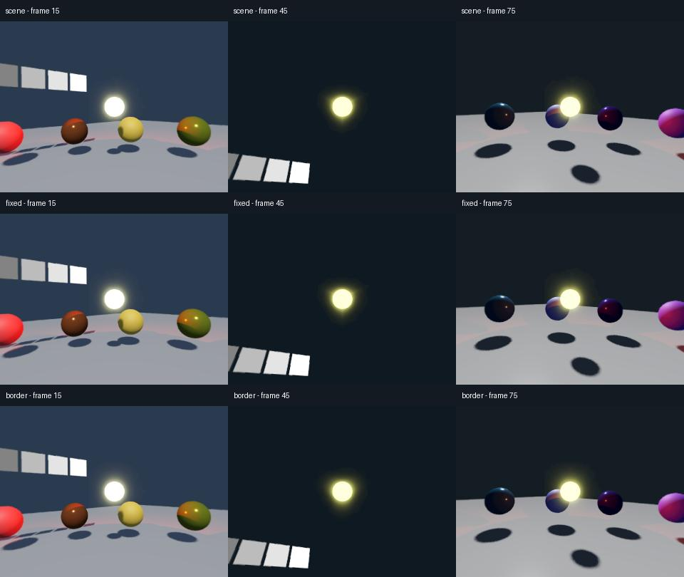

# Moving lights, exposure and capture borders

The combined appearance lab exercises authored exposure and capture borders in
the same shot: moving emissive geometry and an OmniLight3D, directional and point
shadows, metallic/rough materials, alpha transparency, camera translation/rotation,
and a lighting cut. It crosses a front/right edge, a three-face corner, and a
rear/left edge. Exposure changes smoothly while the active attributes move from
the camera to WorldEnvironment, then back to a replacement camera resource.


*Actual Forward+ exports, with the same retained frame in each column. Top: native
scene metering. Middle: fixed authored exposure. Bottom: fixed exposure plus
12.5% capture borders. The middle column includes the authored lighting cut;
the darkening is retained. Borders soften the glow cut, but the corner halo still
has a different shape.*

## What is checked

Each review renders nine three-second 2048×1024/30 FPS clips using 512-pixel face
cores and eight warmup frames. A tenth job re-encodes the bordered capture.

- Fixed exposure is compared frame by frame against a separate scene authored
  with automatic exposure disabled, both with zero and 12.5% borders. PNG and
  decoded MP4 comparisons cover camera/world attribute changes and replacement.
- Glow-disabled lit captures isolate the effect's contribution. Their boundary
  scores are reported separately from actual geometry and shadow edges.
- Unlit opaque controls isolate projection and color from view-dependent lighting.
  Lit shadows and material responses are not required to match across frusta.
- Every delivered clip is fully decoded and counted. Glow must remain visibly
  present; the oracle comparison cannot pass by silently disabling it everywhere.
- Re-encoding must retain the original capture settings and source hashes. The
  disposable addon and fixture files must remain unchanged.

Native Forward+ and Mobile reviews on Windows / RTX 3060 Ti / Godot 4.7.2 / Vulkan
match their authored source-frame oracles, with at most isolated one-level RGB
rounding differences on the repeated Forward+ run. The glow boundary score falls
by 95.5–97.0% in Forward+ and 94.0–95.6% in Mobile. The maximum unlit frame
difference from adding borders is below 0.0021 on the 0–255 RGB scale. These are
fixture measurements, not a percentage of general visual correctness. Exact
package snapshots and remaining limits are recorded in [validation](validation.md).

Source comparisons require mean error below 0.02 and no channel difference above
one level on the 0–255 scale. Decoded comparisons require RMS error below one RGB
level per frame. The repeated Forward+ run measured less than 0.000004 mean source
error and 0.863 decoded RMS; its few source rounding changes alter later CRF
encoding decisions. The initial mean-decoded-error-only threshold rejected this
case, so the reviewer now records both metrics and applies the stricter per-channel
source bound alongside the decoded RMS bound. The original failed report is retained.



*Mobile does not use native automatic exposure, so Scene and Fixed match in this
fixture. Its glow also differs from Forward+'s; the renderer is preserved.*

This laboratory is broader than the isolated glow fixture, but it is still a
small procedural scene. It does not establish production endurance, every shader
combination, temporal effects, or native Mac/Linux GPU support.
The scene is silent: this review checks the delivered audio stream technically,
while cue synchronization remains covered by the existing motion/audio suites.
Capture timing and storage diagnostics are retained for every job. These short
runs, some alongside other checks, do not establish production overhead or a
speedup; 12.5% borders still add 56.25% to face pixel count before other costs.

## Exposure support for 1.0

The 1.0 consistent-exposure workflow uses **authored exposure**, either constant or
animated. The existing **Fixed (authored)** option disables independent automatic
metering while preserving those authored values. **Scene** remains the default
for compatibility and preserves native per-face metering where supported, with
its documented seam risk. No saved recipe is changed by this support decision.

**Shared automatic spherical adaptation is deferred beyond 1.0.** It is not an
acceptance requirement for the authored-exposure workflow. This is a support
boundary, not a claim that adaptive exposure cannot be implemented.

A future adaptive implementation needs one luminance measurement from the HDR
scene, weighted by spherical area without double-counting capture borders, and
one exposure applied to all six views. It must define startup, lighting cuts,
frame-clock adaptation, interaction with authored/physical exposure, and custom
compositor ordering. Godot exposes compositor callbacks per viewport, on the
rendering thread, before built-in post-processing; any approach using these hooks
needs separate validation of that scheduling and its cost. See the official
[CompositorEffect contract](https://docs.godotengine.org/en/4.5/classes/class_compositoreffect.html).
The current assembler receives already tone-mapped SDR pixels, so normalizing
their brightness cannot recover the original HDR luminance or clipped detail.

## Reproduce

From this repository or the unpacked addon package, with NumPy and Pillow:

```sh
python tests/appearance_review.py --godot /path/to/godot --ffmpeg /path/to/ffmpeg --ffprobe /path/to/ffprobe --method forward_plus --driver vulkan --output .godot360/appearance-new
```

Use `--method mobile` with another fresh output folder for Mobile. The reviewer
copies the addon and fixtures into a disposable project, isolates application
settings, and writes `appearance-review.json`, per-frame measurements, logs,
retained PNGs/MP4s, and `comparison.jpg`. Renderer fallback is rejected by the
capture worker. `--analyze` recomputes measurements from an existing completed
review without rendering; it does not replace capture-time preservation checks.

[Capture borders](capture-borders.md) · [Authored exposure](exposure-consistency.md)
· [Private 1.0 checklist](release-readiness.md)
