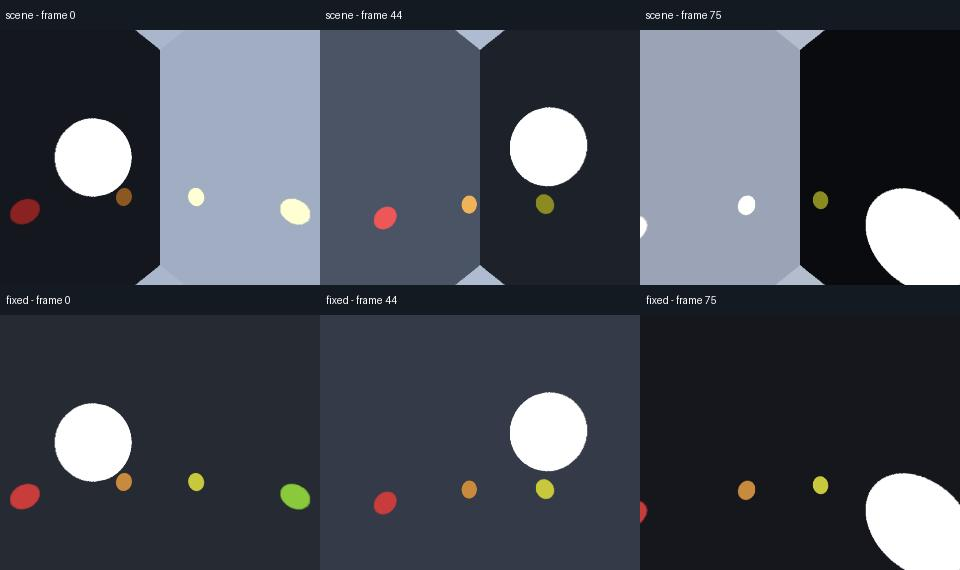
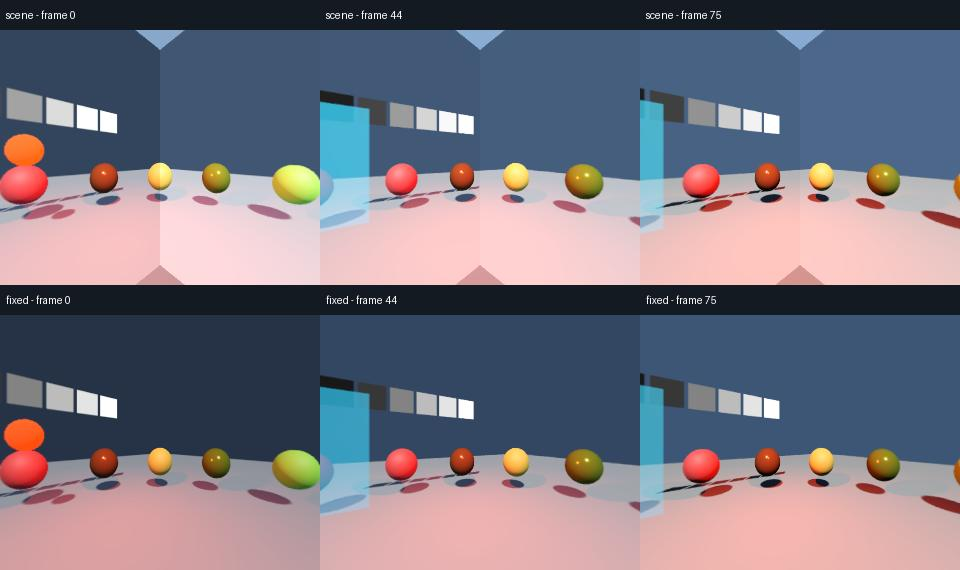

# Consistent authored exposure

**Fixed (authored) capture exposure** gives all six views the same authored exposure
settings. It removes the brightness blocks caused by independent automatic
metering while keeping exposure animation available.

*Actual Forward+ captures of the same frames. The lower row uses the new capture
option. The last frame is darker because the scene's lighting changes; fixed
exposure preserves that authored change.*

In **Advanced → Capture exposure**, choose **Fixed (authored)**, then run a new short
test. Adjust the scene's camera exposure if needed. The default **Scene** preserves
previous behavior. Recipes and local settings remember the mode; a changed mode
invalidates estimates, and re-encoding retains the original capture policy and pixels.

Fixed disables automatic metering in worker-owned camera attributes. Exposure
multiplier, sensitivity, physical settings and depth of field still follow the
selected camera, or WorldEnvironment when the camera has no override. Authored
animation and attribute replacements are sampled in the same frame. Source scenes
and resources stay unchanged.

## What the comparison establishes

The moving-light fixture includes uneven illumination, camera rotation, colored
geometry, a lighting cut, a smooth exposure curve and a runtime resource replacement.
Each job delivers three seconds at 2048×1024 / 30 FPS, using a 512-pixel face core
and eight warmup frames. The oracle is an independently authored version of the
scene with automatic exposure disabled.

The initial Forward+ comparison reduced the measured cube-boundary discontinuity
by **99.7%**. Every fixed-exposure source frame matched its authored oracle exactly;
the default scene mode matched the legacy capture. This is a targeted boundary
metric, not a score for all scene appearance. See [validation](validation.md) for
the accepted package matrix, additional comparisons, decoded-frame checks and cost.

*A second comparison uses the lighting/material laboratory with camera motion,
an ambient-light cut and animated exposure. Fixed reduces the measured boundary
discontinuity by 98.2% and matches the authored fixed-exposure oracle. Directional
lighting, shadow and other view-dependent differences can still remain.*

## Behavior and limits

A shared adaptive mode would need a common measurement of scene luminance before
tone mapping, then apply one exposure to every face. Assembled SDR pixels already
contain each face's tone mapping and clipping. The implemented option therefore
provides an explicit authored-exposure workflow, with no guessed brightness target
or additional image readbacks. Shared HDR metering remains a separate renderer task.

- Fixed uses authored exposure values. It does not freeze the brightness calculated
  by auto exposure in the editor, so switching modes may change overall brightness.
- A light cut stays visible unless you author an exposure change. Automatic
  adaptation based on the whole sphere remains unimplemented.
- Godot's native auto exposure is a Forward+ feature. Mobile and Compatibility
  already use authored exposure without native automatic metering.
- Tone mapping and the SDR color pipeline remain intact. Fixed exposure cannot
  recover clipped highlights or repair other view-dependent effects.
- No extra views, render passes or image readbacks are added. A small CPU update
  copies changed attribute values; borders retain their separate pixel cost.

[Capture exposure and reproduction](../addons/godot360/RENDERERS.md#capture-exposure)
describes settings, the renderer contract and the packaged comparison command.
[Capture borders](capture-borders.md) address missing glow context separately.
