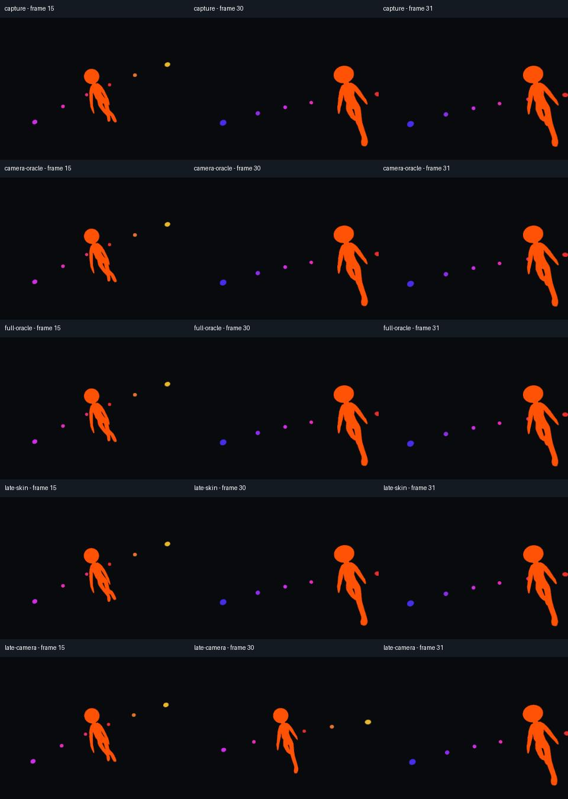

# Imported animation and a head-attached camera

Godot360's timeline capture now has a rendered reference using a real imported
character. The fixture imports **CesiumMan** through Godot's normal GLB importer,
plays its 19-joint animation, and captures from a camera attached to its head.
A camera boom gives an outside view; a 31.5-degree cut occurs at frame 30.



*Actual retained panoramas, projected into the same flat view at frames 15, 30
and 31. Orange isolates shape and motion from lighting. The delayed controls
intentionally demonstrate errors; they are not accepted export behavior.*

## What the reference establishes

The Python evaluator reads the original GLB accessors, interpolates its 57 LINEAR
position/rotation/scale channels, composes the original node hierarchy and applies
joint transforms and inverse bind matrices to 3,273 vertices. It does not read
Godot's resulting poses to construct the reference. The retained binary GLB is
pinned by SHA256 and includes upstream attribution and license notices.

Three exports separate the comparisons:

1. Imported skin and the native BoneAttachment3D camera.
2. The same imported skin and an independently calculated direct camera.
3. Independently deformed CPU geometry with that direct camera.

Each clip has 60 frames at 2048×1024, using 512-pixel face cores. The reviewer checks
all source PNGs and decoded MP4 frames, all 19 joint transforms and the selected
camera after drawing. Source RGB MAE must stay below 0.03, visible foreground MAE
below 0.25, and decoded RGB MAE below 0.1 on a 0–255 scale. The unlit reference
requires over 1,000 orange character pixels in every frame, preventing an empty
scene from passing. Matrix-element error must stay below 0.00005.

`--negative-control` adds a one-frame-delayed CPU skin and a one-frame-delayed
camera. Both must fail the image comparison. The camera control includes the
late viewpoint cut. `--textured` retains the original material and texture and
compares camera paths using identical native skinning on both sides.

## Import settings matter

The first investigation used Godot's default import settings. Its optimized
animation differed from the raw GLB: maximum bone-matrix error reached 0.0194 and
camera foreground RGB error reached 1.90. That is not evidence of a capture bug.
Disabling import optimization restored the expected poses to within 0.000002 on
the initial Windows Compatibility review.

For this exact-source test, the disposable import disables animation optimization,
immutable-track removal, mesh compression and generated LODs. It keeps all 57
source channels and matches the animation import bake FPS to the export FPS.
A 60 FPS raw-source comparison against a 30 FPS bake also found differences
between bake samples (maximum bone-matrix error 0.0269); retain the source and
reimport at the desired rate when that precision is required.
This isolates capture behavior from lossy import choices and
does not change the user's project or the addon's import behavior. Compare your
export with the **imported** animation; review import settings if matching the DCC
source more closely is important. Godot documents these processing stages in its
[scene importer](https://github.com/godotengine/godot/blob/4.5-stable/editor/import/3d/resource_importer_scene.cpp).

No runtime correction was required for this fixture. The existing deferred camera
synchronization works with its imported skeleton. Read the [validation record](validation.md)
for the final engine/renderer matrix, package hash and hosted evidence.

## Use an imported clip

Point the [timeline helper](../addons/godot360/AUTHORING.md) at the imported
AnimationPlayer and its actual animation name. Use a non-looping capture clip
that covers the requested duration. Select the Camera3D below the attachment as
the export source; changing another camera's `current` property does not cut the
export. A cut changes the selected camera's transform.

This establishes one GLB/AnimationPlayer workflow. IK/modifier ordering, nested
skeleton attachments, ragdolls, physics interpolation, animation trees,
retargeting, other file formats and long temporal histories remain separate work.
The textured check covers its original material, not arbitrary character shaders.
The clips are silent; the existing motion/audio fixtures establish audio timing.

## Reproduce

Use the dependencies in [testing](testing.md) and a fresh output directory:

```sh
python tests/imported_character_review.py --godot PATH_TO_GODOT --ffmpeg PATH_TO_FFMPEG --ffprobe PATH_TO_FFPROBE --output .godot360/character-new --method forward_plus --driver vulkan --negative-control
```

Options include `--method gl_compatibility --driver opengl3`, `--method mobile`,
`--warmup 0`, `--border 12.5`, `--fps 60`, and `--textured`. The report, actual
images, source references, imported settings and logs stay under the output folder.
Hosted CI runs the packaged fixture with Mesa on Linux; that is narrower than
native Linux GPU validation.

CesiumMan and these derived views: © 2017 Cesium,
[CC BY 4.0](https://creativecommons.org/licenses/by/4.0/).
[Pinned source and notices](../tests/fixtures/cesium_man/README.md).
The original logo remains governed by its separate mark notice; it is not
Godot360 branding. Reference math follows the
[glTF 2.0 specification](https://registry.khronos.org/glTF/specs/2.0/glTF-2.0.html).
