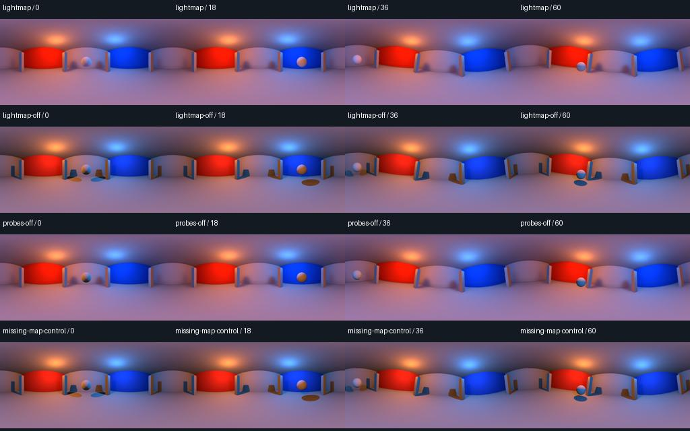

# Capturing a saved LightmapGI bake

`tests/lightmap_review.py` bakes a small room in a disposable Godot editor, saves
the scene and lighting resources, closes the editor, then starts fresh export
workers. Capture uses those saved assets; it does not bake lighting at runtime.

## Native results — 2026-09-10

Windows 11 / RTX 3060 Ti / Godot 4.7.2 passes:

| Capture method | Border | Completed clips | Result |
| --- | --- | --- | --- |
| Forward+ / Vulkan | 0% and 12.5% | Eight | Six accepted clips; two missing-map controls rejected. |
| Mobile / Vulkan | 12.5% | Four | Three accepted clips; missing-map control rejected. |
| Compatibility / OpenGL | 0% | Four | Three accepted clips; missing-map control rejected. |

The **16 clips / 1,152 source and decoded delivery frames** include four
intentionally incorrect controls. All twelve normal clips pass the original
thresholds. Maximum accepted face mean error is **0.000039/255**,
independent panorama mean error is **0.143860/255**, and decoded
RMS error is **1.186252/255**. Every clip rejects delayed native
references, and the static-lightmap and dynamic-probe contributions pass in every
frame. All methods reopen the same immutable saved bake: ten static receivers,
one directional atlas and 396 probe points. The capture runtime needed no change.



*Delivered frames 0, 18, 36 and 60. The last row is intentionally wrong and is
rejected against an intact native reference. The disabled-probe row isolates
indirect lighting on the sphere. [Bordered Forward+](media/lightmap-border.jpg),
[Mobile](media/lightmap-mobile.jpg) and [Compatibility](media/lightmap-compatibility.jpg)
sheets are retained too.*

The exact 227-member addon package rebuilds identically and passes **3,075
headless/failure checks**: 1,025 each on Godot 4.5.1, 4.6.3 and 4.7.2. Those
cross-version checks do not extend native LightmapGI evidence beyond 4.7.2.
The Baked LightmapGI workflow passes local actionlint. See [validation](validation.md)
for the latest hosted checkpoint status, source hashes and failed fixture
experiments. Development remains on the private 0.8.0 baseline.

## What the review checks

Ten static ArrayMesh surfaces have unwrapped UV2 coordinates. Two static lights
produce a directional lightmap atlas and automatically placed probes. A dynamic
white sphere orbits through the colored room, crossing cube boundaries and the
rear seam. Frame 36 changes the camera's position and rotation.

The reference uses a second instance of the saved room in a separate World3D.
Six independent native cameras match the capture faces; a seventh perspective
view straddles a cube edge. Every draw records camera poses, viewport settings,
the reference cameras' actual world, lightmap users and the moving object's GI
mode. The capture and reference worlds share immutable baked resources.

Four cases isolate the supported behavior:

| Case | Purpose |
| --- | --- |
| Lightmap enabled | Preserve baked static lighting and indirect lighting on the moving object. |
| Lightmap disabled | Establish that the saved bake visibly contributes to static surfaces. |
| Dynamic probes disabled | Isolate probe lighting on the sphere while keeping static lightmaps and real-time direct lights. |
| Missing-map control | Remove the captured lightmap while leaving the independent reference intact; image acceptance must fail. |

Each clip contains 72 delivered frames at 1024×512 / 30 FPS, with 256-pixel cube
cores and eight warmup draws. A CPU projection assembles the six native images
independently of the capture shader. Every source frame and every decoded MP4
frame is compared, including the opening and the cut. A one-frame-late reference
must also be rejected in every clip.

The unchanged temporal-review thresholds require maximum per-face mean error
below 0.15 RGB levels and 99th-percentile error at most two levels, independent
panorama mean error below 0.2 with p99 at most two, and decoded RMS below two.
All use the 0–255 scale. All thirteen delivery checks must pass. Every frame must
show at least one level of static-lightmap contribution outside the moving sphere
and 0.5 levels of probe contribution inside its analytic inner silhouette.
Diagonal-view and boundary-strip differences remain observations of perspective
and resampling, not acceptance thresholds or seamlessness guarantees.

## Authoring and limits

Bake and save the scene in Godot before exporting. Static receivers need UV2
coordinates and Static GI mode. Keep the baked scene, `.lmbake`, EXR textures and
their import settings together. Re-bake after changing static geometry, UVs or
baked lights. Dynamic receivers need probes covering their path; their direct
lighting still comes from the scene's real-time lights. See Godot's
[LightmapGI guide](https://docs.godotengine.org/en/stable/tutorials/3d/global_illumination/using_lightmap_gi.html)
and [LightmapGI resource contract](https://docs.godotengine.org/en/stable/classes/class_lightmapgi.html).

The reviewer bakes using Forward+ and Vulkan, including when the later capture
uses another renderer. This is a desktop editor preparation step with a graphics
device; headless import or a runtime capture cannot substitute for it. The helper
uses the editor's English Bake Lightmaps action and save dialog, and fails if
those controls or the resulting baked resources are unavailable.
The disposable bake editor explicitly uses Godot's Dummy audio driver because
baking needs no audio device. Capture and delivery audio settings are unchanged.

The fixture is one small enclosed layout, with ten static receivers, one atlas
and one moving probe receiver. It does not cover streamed/multiple LightmapGI
nodes, shadowmask combinations, moved static receivers, giant atlases or mixed
GI/temporal/transparency stacks. It does not establish 4K/8K resource budgets,
native Linux/Mac GPU coverage or general bake quality. A successful encode is
not proof that an authored lightmap is present; the missing-map control tests the
reviewer's sensitivity, not automatic missing-lightmap detection in the addon.

## Reproduce

Use Godot, FFmpeg/FFprobe, NumPy and Pillow from [developer setup](testing.md).
Run from source or an unpacked addon package, with a fresh output directory:

```sh
python tests/lightmap_review.py --godot PATH_TO_GODOT --ffmpeg PATH_TO_FFMPEG --ffprobe PATH_TO_FFPROBE --output .godot360/lightmap-new
```

Use `--border 12.5` for expanded capture faces. `--method mobile` and
`--method gl_compatibility` select the other capture methods. All variants still
prepare the bake with Forward+/Vulkan. To reuse exactly the same saved bake,
pass `--baked-from .godot360/lightmap-new/project/generated` with a fresh output.
`--warmup` accepts zero through ten; a changed value requires its own review.

`--analyze` recomputes an existing review, verifies its captured source/bake
hashes and decodes the existing delivery/reference MP4s. It does not render or
regenerate the oracle. Output retains the baked assets, exact source snapshot,
per-frame measurements, native/face/source images, decoded comparisons and logs.
The Baked LightmapGI workflow prepares Linux software-renderer coverage from an
unpacked candidate; hosted execution must be recorded separately.

[Temporal effects and VoxelGI](temporal-capture.md) · [Release readiness](release-readiness.md)
