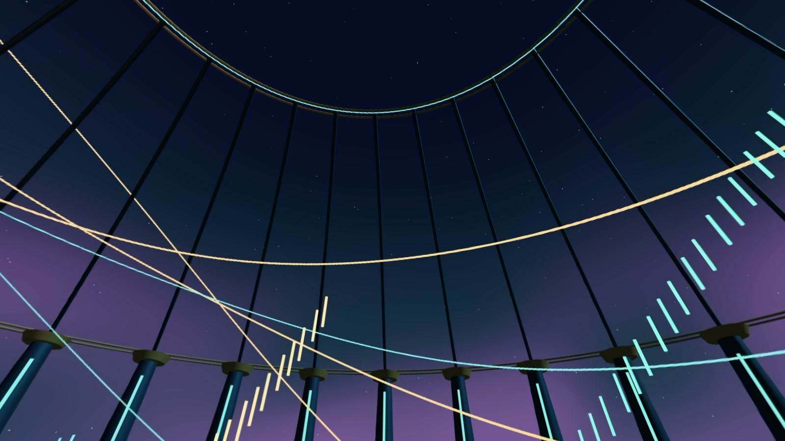
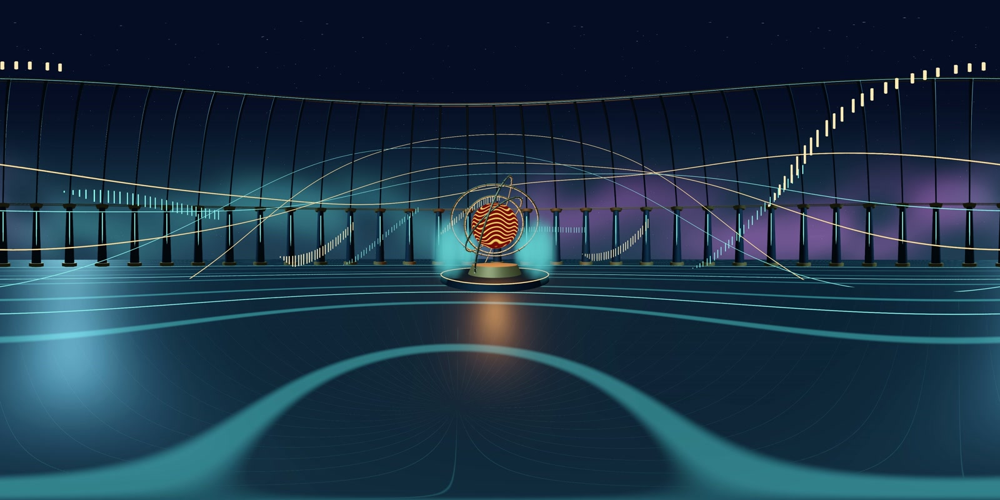

# LUMEN — an orbital observatory

**A 24-second 360° film with an original score, rendered at 4K.** An artificial
star turns inside a mechanical observatory while light trails circle the viewer
and vapor rises around the instrument.

[](media/lumen-tour.mp4)

**[Watch the flat tour with sound](media/lumen-tour.mp4)** ·
[Full 4K spherical film, after rendering locally](../renders/lumen-4k-final/film/video-360.mp4)

## What it can be used for

LUMEN is an example of an immersive music film, a museum installation or an
observatory sequence for a planetarium. The architecture surrounds the camera:
turning away from the central star reveals more moving lights, overhead rings
and an open sky. A venue still supplies its own projection and playback setup.

The camera rises and travels slowly over 24 seconds. Everyone sees the same
timeline, while each viewer chooses a direction. The score is stereo; it does
not rotate with the viewing direction.



## Open and export it

1. Open this repository in Godot and enable the Godot360 bottom panel.
2. Load `export_profiles/lumen-4k.tres` under **Recipes and examples**. The recipe
   selects **Forward+**, 4096×2048, 30 FPS, 24 seconds, 2048-pixel face cores,
   12.5% capture borders and the included soundtrack.
3. Select FFmpeg/FFprobe and an output directory, then use **Check setup** and
   **Test 1 second** before the full render.
4. Use **Render 360 video**, then **Play video** to look around and listen.

The recipe selects the export renderer without changing the project's saved
Compatibility renderer. Native particle trail history requires Forward+ or
Mobile; this film is validated on Forward+. For live exploration, launch a
separate Forward+ instance:

```sh
godot --path . --rendering-method forward_plus res://scenes/films/Lumen.tscn
```

Hold the left mouse button and drag to look around. Escape closes that instance.
Restart the scene to replay its opening and music.

## Reusable parts

| Part | Where it is | How it works |
| --- | --- | --- |
| Observatory, camera and choreography | `scripts/films/lumen.gd` | Procedural geometry and absolute-time camera/core animation. Emitter movement runs before child simulation. |
| Short luminous trails | Eight GPUParticles3D nodes | Native TubeTrailMesh history, fixed 30 FPS, two capture warmup frames and fixed seeds. |
| Soft vapor | Four GPUParticles3D nodes | The optional point-facing smoke shader keeps a consistent orientation across cube faces. |
| Long orbital rings | Ordinary tube meshes | Authored geometry; these are distinct from the short native particle trails. |
| Star, floor and sky | `assets/films/lumen/` | Original shaders with an explicit animation clock and fixed exposure. |
| Music | `assets/audio/lumen-score.wav` | Original 48 kHz stereo synthesis; regenerate with `tools/compose_lumen.py` into a fresh destination. |
| Portable export settings | `export_profiles/lumen-4k.tres` | Scene, camera, renderer, resolution and audio; executable paths stay local. |

LUMEN shares the repository's procedural geometry helpers. It needs no downloaded
models, texture packs, music recordings or third-party web libraries.



## Reproduce the delivery and previews

The helper copies only the addon and film dependencies into an isolated project,
uses a fresh output folder, and verifies the final MP4 and preserved settings:

```sh
python tools/render_lumen.py --godot /path/to/godot --ffmpeg /path/to/ffmpeg --ffprobe /path/to/ffprobe --output renders/lumen-4k-final
python tools/build_lumen_media.py --ffmpeg /path/to/ffmpeg
python tools/play_lumen.py
```

Open [the local spherical player](http://127.0.0.1:8361). It offers drag/keyboard
navigation, seeking, sound controls and the 4K download. It serves only its player
and three film files on loopback. The browser copy is 2048×1024; the delivery is
4096×2048. The documentation tour is a 1920×1080 edit showing four directions.
NumPy is needed only for regenerating the score, not for using the addon.

For a short draft, add `--width 2048 --face-size 768 --seconds 6` to the render
command and choose a new output folder. Particle history begins at the opening;
skipping directly into the middle would require an authored pre-roll.

## Validation and limits

The delivered film uses Godot 4.7.2, Forward+/Vulkan on Windows with an RTX 3060 Ti.
The render checks all 720 delivered frames are present and all 13 MP4 delivery
conditions pass. Local source/settings hashes and render timings are retained
beside the job. This is a composed example with native trail and smoke fixtures
tested separately; it is not an independent reference for every pixel in the film.

The final run took **232.48 seconds** and retained **2.70 GiB** of frames/audio/
delivery files. All 722 source images (including two warmup images) are present
in order. Decoded stereo audio has 1,152,000 samples and matches the score at
3, 11 and 20 seconds with zero measured sample lag and correlations above 0.9998.
These are observations on this machine, not portable render-time estimates or
peak-VRAM measurements. The source audit is `renders/lumen-4k-final/audit.json`.

The visual review replaced the first background with LUMEN's own smooth sky
shader. It also avoids a negative base in `pow`, which is undefined in the
[shader function contract](https://docs.godotengine.org/en/stable/tutorials/shaders/shader_reference/shader_functions.html#pow).
Earlier experimental renders are retained separately. THRESHOLD's sources and
masters are unchanged.

Capture borders reduce tested glow cuts but do not guarantee seamless arbitrary
screen-space effects. General transparent sorting, lit smoke and long/stateful
effect histories remain separate validation work. This demo does not close the
heavy 4K/8K endurance or native Linux/Mac release gates.

[Smoke setup](smoke-capture.md) · [Native trails](trail-capture.md) ·
[Validation record](validation.md) · [Other examples](showcase.md)
