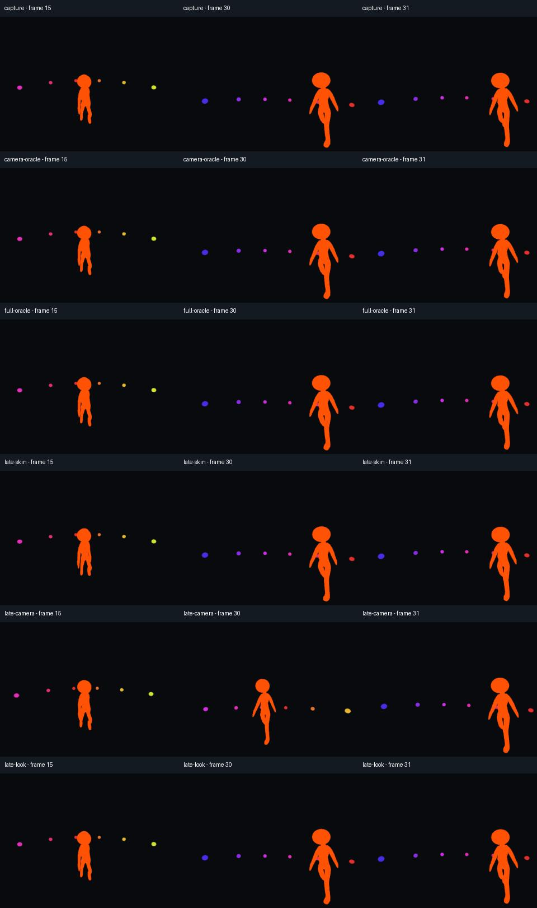

# Head-look modifiers and nested skeleton attachments

The imported CesiumMan fixture now includes a procedural head-look modifier and
a second skeleton below its head attachment. The skin and selected camera are
compared with independent references, including the opening, every moving frame
and a viewpoint cut. This bounded setup works with the existing deferred camera
synchronization; no addon runtime correction was needed.



Top to bottom: native capture, direct reference camera, CPU skin reference,
delayed skin, delayed camera and delayed head-look target. The image is the
unchanged Forward+ review contact sheet. CesiumMan and these derived views:
© 2017 Cesium, CC BY 4.0; [source and mark notices](../tests/fixtures/cesium_man/README.md).

## Supported setup

The tested head look is a small **custom `SkeletonModifier3D`**, implemented in
[`head_look.gd`](../tests/fixtures/head_look.gd). It aims the head toward a moving
world-space target, preserves the animated head position and uses a fixed basis
to account for this imported rig's bone orientation. The fixture has unit scale,
full modifier influence, no damping and no accumulated simulation state. This
does not establish support for every built-in LookAt/IK solver or modifier chain.

Use the timeline helper to sample the AnimationPlayer first. Set the skeleton's
modifier callback mode to **Manual**, update the target from the absolute sample,
then call `skeleton.advance(0.0)` in `sample_360_frame`. For example:

```gdscript
func begin_360_capture(job: Dictionary) -> String:
    skeleton.modifier_callback_mode_process = Skeleton3D.MODIFIER_CALLBACK_MODE_PROCESS_MANUAL
    return super.begin_360_capture(job)

func sample_360_frame(frame: int, seconds: float, job: Dictionary) -> String:
    var error := super.sample_360_frame(frame, seconds, job)
    if not error.is_empty():
        return error
    target.position = authored_target_at(seconds)
    skeleton.advance(0.0)
    return ""
```

`advance` schedules the modifier pass; it does not synchronously return the final
modified bones. Zero delta is appropriate here because the pose is a pure function
of the sampled animation and target. Warmup repeats sample zero, including with
ordinary scene processing disabled. A spring, damped look or physics solver needs
its own time and warmup policy; applying this snippet to a stateful solver is not
validated. Do not combine automatic modifier processing with a manual advance.

Read final modified bones in `Skeleton3D.skeleton_updated` when another skeleton
depends on them. Godot restores the animation's base bone poses after submitting
the skin; a later `get_bone_global_pose()` can therefore describe the base pose.
Keep a copy from the signal if a later consumer needs those values. See
[Godot's Skeleton3D reference](https://docs.godotengine.org/en/4.5/classes/class_skeleton3d.html#signals).

The rendered hierarchy is:

```text
Imported Skeleton3D + head-look modifier
  → external HeadAttachment (at the scene root)
      → NestedSkeleton (local mount offset)
          → MountAttachment (nested bone)
              → Boom (local camera offset)
                  → selected Camera3D (frame-30 local viewpoint cut)
```

The nested mount rotation is authored in the upstream `skeleton_updated` callback.
Its attachment then follows the second skeleton's queued update. Headless checks
also cover one and two nested skeletons, both parent and external upstream
attachments, repeated samples, backward wrap and removal of the source camera.
Attachments use `override_pose = false`. Godot documents interaction risks between
attachment pose overrides and modifiers in its
[BoneAttachment3D reference](https://docs.godotengine.org/en/4.5/classes/class_boneattachment3d.html).

Cuts change the selected camera's local transform. Setting a different camera's
`current` flag does not switch the export source. Temporal cut appearance remains
a separate rendering check.

## Independent checks

Python reads the pinned raw GLB, samples its animation, constructs the target-facing
basis from vector cross products and applies weighted CPU skinning. It composes the
nested mount, boom and cut without reading Godot's resulting transforms. Native
skin, camera and nested transforms are observations only. Import settings and
asset attribution are the same as in [the imported-character review](imported-characters.md).

The reviewer checks final bones during `skeleton_updated`, restored base bones
after drawing, the source camera and all six cube cameras. Transform checks include
every warmup sample. Image comparisons cover all 60 delivered PNGs and all decoded
MP4 frames, using the existing thresholds: source MAE <0.03, foreground MAE <0.25,
decoded MAE <0.1, and matrix-element error <0.00005. Foreground/character pixel
counts prevent empty views from passing.

With `--negative-control`, a one-frame-late skin, camera and head-look target must
each fail its image comparison. The delayed target must also fail the final-bone
comparison. These controls isolate timing errors from a merely successful encode.

```sh
python tests/imported_character_review.py --godot /path/to/godot --ffmpeg /path/to/ffmpeg --ffprobe /path/to/ffprobe --method forward_plus --driver vulkan --output .godot360/head-look-new --head-look --nested --negative-control
```

Omit `--nested` for the head-only case. Use `--method mobile --driver vulkan` or
`--method gl_compatibility --driver opengl3` for the other renderers. `--warmup 0`,
`--border 12.5`, and `--textured --fps 60` select additional cases; textured mode
compares camera timing using the original material. See [validation](validation.md)
for the accepted native matrix and exact package evidence.

Built-in solver chains, partial-influence blending, damping, ragdolls, attachment
pose overrides, physics interpolation and retargeting remain separate cases.
Arbitrary late deferred callbacks that change a pose after camera synchronization
are outside this setup. The next scheduled engineering work is complex particles:
smoke, billboards, trails and moving emitters.
