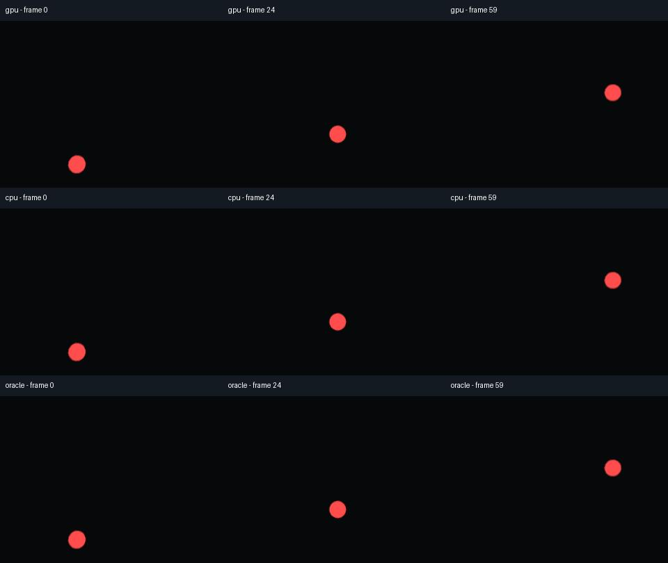
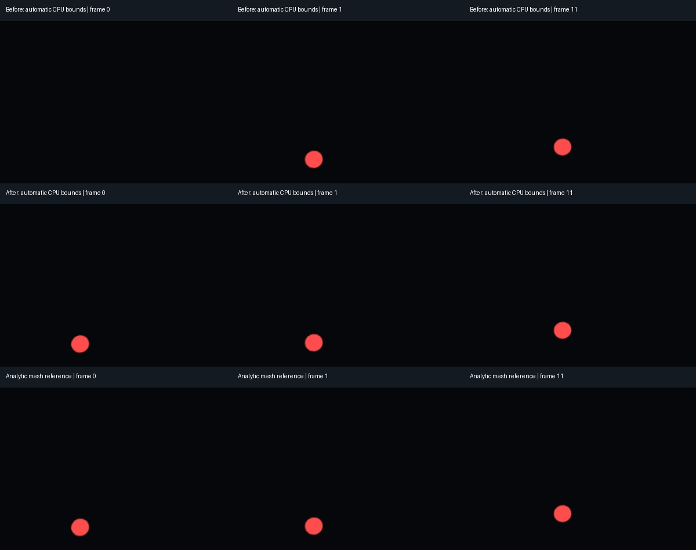

# Particle startup, timing and authored pause states

Capture now preserves a scene's authored processing mode. Previously, it forced
the root to `INHERIT` at startup and after every captured frame: disabled scenes
began running, and scenes that paused themselves resumed on the next frame.
Warmup now restores the saved mode once. Zero warmup does not change it.
The capture worker also disables realtime physics jitter compensation and refreshes
Compatibility CPU automatic bounds before drawing. The measured two-frame warmup
mismatch, repeated matching-rate step and missing automatic-bounds opening frame
are fixed. Zero-warmup GPU startup remains outside the validated contract.

The new fixture checks CPU and GPU particles in the shared 3D world, with eight
opaque colored spheres moving through cube-face boundaries. A separate scene
places ordinary meshes at the analytically expected positions. The reviewer
compares every retained PNG and every decoded MP4 frame.



*Each column shows the same output frame. The flat view looks toward a cube edge
at 45° yaw. These are rendered views of the export, with no synthetic particle art.*

## Tested behavior

The reference uses constant unit velocity, one particle per emitter, opaque sphere
meshes, no gravity or collisions, **particle Fixed FPS = 0** or a fixed rate matching
the export FPS, GPU interpolation off and fixed GPU seeds. Both emitter types use
explicit visibility bounds, with a separate CPU automatic-bounds case. The scene
runs once per movie frame; all six cameras see the
same simulation. The first delivered native simulation sample is one frame interval
after emission, followed by one interval per frame. This differs from a property's
absolute timeline sample at time zero.

Comparisons cover two and eight warmup frames, with another GPU export at ten
frames and an authored `ALWAYS` root. Mode checks also cover a `DISABLED` root,
`WHEN_PAUSED` while the tree is unpaused, zero warmup, and a CPU scene that disables
itself at frame 15. The latter must stop both script ticks and visible particle
movement. The old worker fails all four mode cases, providing a negative control.

See [validation](validation.md) for the accepted native engine/renderer matrix,
exact counts, package hash and CI results. This small test establishes these
particle cases, not general particle-effect compatibility.

## Fixed capture clock

The old worker passed `--fixed-fps`, but Godot's realtime physics jitter compensation
still altered the opening process deltas. At 30 FPS with two warmup frames, the
fixture recorded **41.6667, 29.1667, 30 and 32.5 ms** before settling to 33.3333 ms.
Three/four-frame warmup could leave a persistent motion offset. A fixed 30 Hz GPU
emitter repeated a step at delivered frame 3. Increasing warmup concealed these
clock differences rather than fixing them.

Capture now sets `Engine.physics_jitter_fix = 0` in the disposable worker before
the scene starts. The process-delta trace and analytic particle references check
the result; disabling OS delta smoothing alone did not fix it. The saved project's
physics tick rate and time scale stay in effect, and the editor is unaffected.
Godot describes the clock tradeoff in its [Engine reference](https://docs.godotengine.org/en/4.5/classes/class_engine.html#class-engine-property-physics-jitter-fix).
The reviewer requires every ordinary process delta to equal `1 / export_fps` at
normal time scale, alongside the source and decoded image comparisons.

Re-encoding retained PNGs preserves their original timing. Render again to apply
the clock correction to an older capture. A different particle/export rate can
legitimately repeat positions; it requires a quantized reference of its own.

## Compatibility automatic bounds

Before the fix, CPU emitters with automatic bounds were entirely missing from the
first delivered Compatibility frame even with eight warmup frames. Querying their
MultiMesh bounds after their `frame_pre_draw` buffer updates removes the gap.
Neither a general GPU synchronization nor disabling culling fixed the test.



*The same flat view at delivered frames 0, 1 and 11. Before, after and reference
use eight warmup frames. The complete spherical frame is checked numerically.*

The worker now uses `RenderingServer.multimesh_get_aabb` for visible CPU emitters
collected during scene setup, only in Compatibility and only while visibility and
custom bounds remain automatic. It does not step or restart the simulation,
replace bounds or alter emitter properties. Timing reports include
`particle_bounds_sync_usec`. Explicit bounds remain useful for authored effects;
include the mesh extent and full motion, and recheck after editing the effect.
The fixture's explicit AABB begins at `(-2, -2, -2)` with size `(4, 8, 4)` relative
to each emitter. Dynamically spawned/reactivated emitters are not established by
this startup fixture.

## Remaining limits

Use **at least two warmup frames** in the recipe Inspector and review the opening
and motion. The default two now pass the simple fixture; complex effects can need
more. Zero-warmup GPU exports can still begin with missing particles or inconsistent
directions and retain a simulation offset. Scene notes flag fewer than two frames.
Adjust particle Fixed FPS/interpolation in the authored scene if needed.
The addon preserves those choices. Warmup holds ordinary
scene processing and does not create a mature effect: emitter preprocessing or a
deliberate authored pre-roll requires its own review. Explicit child process modes
and autoloads follow Godot's normal rules.

GPU randomness needs the emitter's own fixed seed; the job's global random seed
does not configure it. Preprocessing, random emission, trails, transparency,
billboards, collisions, subemitters, moving/animated emitters, temporal antialiasing
and long histories remain outside this analytic fixture's coverage. Repeatability
across engines or GPUs is not claimed. See the portable
[authoring guidance](../addons/godot360/AUTHORING.md#particle-simulation-and-processing-modes)
and Godot's [particle property reference](https://docs.godotengine.org/en/4.5/classes/class_gpuparticles3d.html).

## Reproduce the review

From the checkout or unpacked addon package, with NumPy/Pillow installed and a
working graphics backend:

```sh
python tests/particle_review.py --godot /path/to/godot --ffmpeg /path/to/ffmpeg --ffprobe /path/to/ffprobe --output /path/to/fresh-review --method forward_plus --driver vulkan --lifecycle --short-warmup --fixed-step
```

Use `--method mobile --border 12.5` for the bordered Mobile case, or
`--method gl_compatibility --driver opengl3`. The basic run exports four two-second
2K clips; `--lifecycle` adds four processing-mode clips.
`--short-warmup`, `--fixed-step` and `--automatic-bounds` require those cases to match
the settled reference, including the first delivered frame. Automatic CPU bounds
are checked with both two and eight warmup frames. `--fps 24|30|60` changes
the export rate and matching fixed particle rate; each clip still has 60 frames.
`--gpu-only` omits CPU appearance comparison, retaining CPU processing-mode tests
when `--lifecycle` is selected. Only zero-warmup appearance remains under `startup`
and does not gate acceptance. All cases check process deltas and unchanged authored
emitter settings. `--lifecycle-only --baseline-worker PATH`
checks the old worker against the processing contract and must fail.

The reviewer uses foreground errors as well as whole-image errors so missing or
late small particles cannot pass by being surrounded by empty background. Source
and decoded comparisons accept <0.03 and <0.1 mean RGB error respectively, with
>200 foreground pixels and <0.25 foreground error, all on a 0–255 scale.

[Testing](testing.md) · [Remaining 1.0 work](release-readiness.md)
