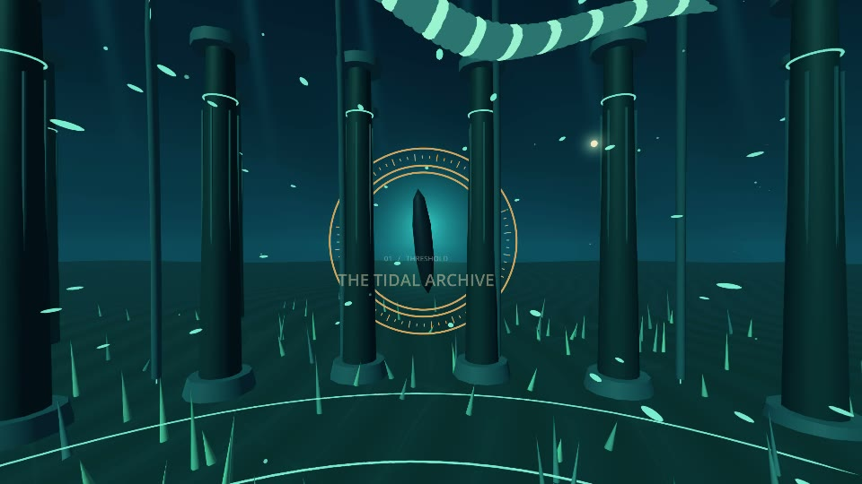
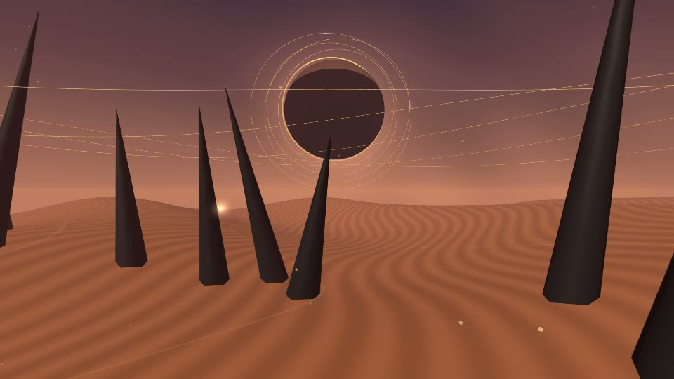
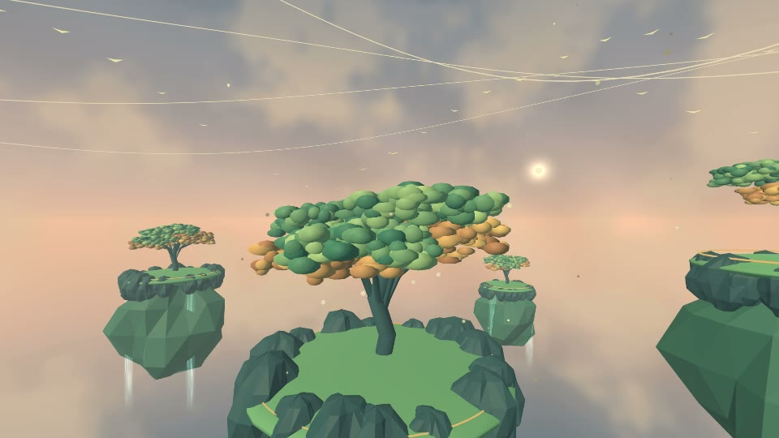
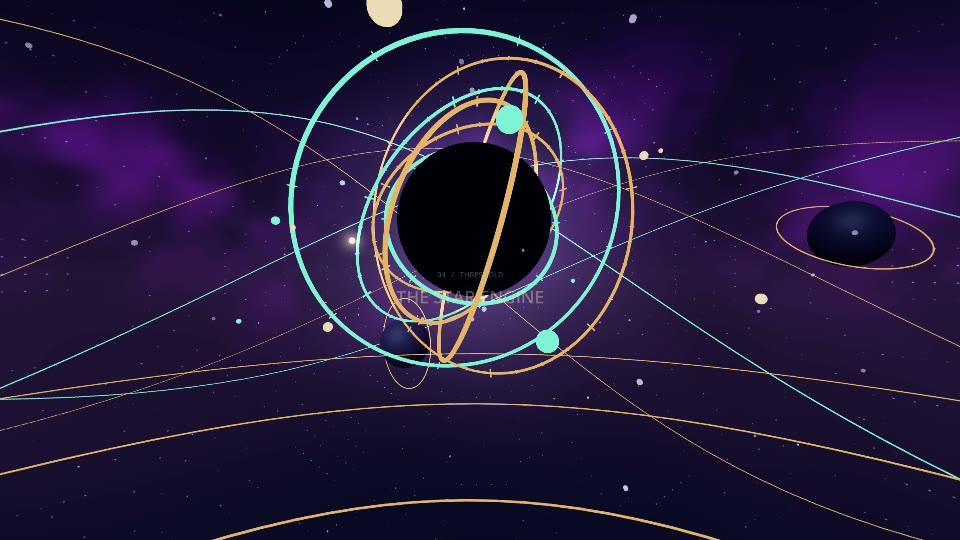
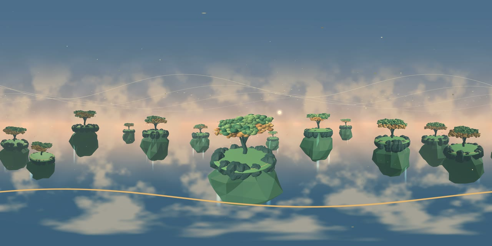

# See what Godot360 can do

**Make a video of the world around your camera.** Godot360 captures your Godot 3D
scene in every direction, combines the views into a panorama and produces a 360°
MP4 with sound. During playback, viewers choose where to look.

**[Watch all four films in 360° on YouTube ↗](https://www.youtube.com/playlist?list=PLUjBgihWYNpQ)**
· [THRESHOLD flat preview with sound](media/threshold-tour.mp4)
· [Animated excerpt](media/threshold-tour.gif)
· **[Make your first export →](../addons/godot360/QUICKSTART.md)**

The YouTube films let you drag to look around on desktop or swipe in the mobile
app. Choose the highest available playback quality. The local MP4 previews are
ordinary perspective views of the same scenes; they cannot be dragged to look
around. Export recipes reproduce the full spherical deliveries.

## Four worlds, one film

**[Watch THRESHOLD in 360° ↗](https://www.youtube.com/watch?v=zntHEAhrnWQ)**

**THRESHOLD** is a finished 60-second example rendered at **7680×3840, 30 FPS**
with an original stereo score. It demonstrates animated geometry, camera movement,
world changes and authored transitions in one 360° sequence.

| The Tidal Archive · 0–14 s | The Glass Desert · 14–29 s |
| --- | --- |
|  |  |
| Moving schools and an enormous drifting creature surround an underwater cathedral. | Rings move around an eclipsed sun above the dunes. |

| The Sky Garden · 29–44 s | The Star Engine · 44–60 s |
| --- | --- |
|  |  |
| Floating islands, leaves, waterfalls and a circling flock fill the surrounding sky. | A seven-ring machine, satellites and planets lead into the ending. |

**Try it:** open `scenes/films/Threshold.tscn` in Godot and press **F6**. Hold the
left mouse button and drag to look around. To export, load
`export_profiles/threshold-8k.tres` under **Recipes and examples**. Use **Test 1 second**
to measure cost before a full 8K render. [Film, music and authoring details](threshold.md).

## An orbital observatory for immersive music

**LUMEN** is a 24-second 4K film with an original stereo score. Native particle
trails circle the room, vapor rises around a gyroscope and luminous rings cross
the open roof. It demonstrates a scene for an immersive music film, installation
or planetarium sequence. [Watch in 360° on YouTube](https://www.youtube.com/watch?v=Xy5PmSpqY7s),
[watch the flat tour](media/lumen-tour.mp4) or
[open the scene, recipe and spherical player](lumen.md).

## A room that dances to the music

**AFTERGLOW** is a one-minute 4K film with an original 116 BPM disco-funk score.
Glass tiles lift with the bass, columns sway, lights orbit and a mirror crown
unfolds above the viewer. [Watch in 360° on YouTube](https://www.youtube.com/watch?v=TK2PuQ3n_XU),
[watch the complete flat preview with sound](media/afterglow-tour.mp4)
or [explore the scene, export recipe and music credits](afterglow.md).

## What makes it 360°?

The export stores **the whole sphere** as a flat, 2:1 equirectangular image.
A 360-capable player wraps that image around the viewer and displays the portion
they are looking at. The two images below show the same moment at 35 seconds:

*The stored panorama: every direction in one frame. Stretching toward the top and
bottom is part of this projection.*

*A viewing direction inside that panorama. The example video uses this fixed
direction; Godot's spherical review lets you drag to explore other directions.*

You choose where the camera goes; the viewer chooses where to look. A video has a
fixed timeline, so viewers cannot walk freely through the scene or trigger live
gameplay. [Prepare camera movement and interactive scenes for capture](../addons/godot360/AUTHORING.md).

## The workflow inside Godot

*Current panel captured in an isolated Godot project, with a one-second calibration
sample open as a full-resolution still beside an eight-second editable recipe.
Video playback uses a separate native copy limited to 2K / 30 FPS.*

1. **Select a scene and Camera3D.** Use your current scene or choose another saved scene.
2. **Choose quality, duration and audio.** Keep basic settings together; expand timing,
   encoding and renderer controls when needed.
3. **Check setup → Test 1 second.** Confirm the tools and output folder, inspect a
   sample, and estimate the full job's time and storage.
4. **Render 360 video → Play video.** Review movement and sound, drag the preview,
   and inspect scene-effect notes. Check the original MP4 for final detail.
5. **Return to your work.** Recent exports reopens saved jobs. Retained captures can
   be re-encoded with different audio or compression settings.

[Start the walkthrough](../addons/godot360/QUICKSTART.md)
· [Every panel and workflow state in screenshots](../README.md#screenshot-tour)
· [Playback and review quality](../addons/godot360/PLAYBACK.md)
· [Recovery](../addons/godot360/RECOVERY.md)

## An interactive scene prepared for film

**[Watch UMBRAL in 360° · 12 s, silent ↗](https://www.youtube.com/watch?v=zWUyKH0Q31I)**

**UMBRAL** begins as an interactive installation: look toward objects to discover
their reactions. Its export recipe prepares an authored **12-second sequence**
for video. This still comes from the rendered film at three seconds.

Press **F5** to explore the installation in Godot. Load
`export_profiles/umbral-film.tres` to export its film. The distinction matters:
gaze interaction runs in Godot; the exported MP4 plays the prepared sequence for
every viewer. [Controls, scene structure and capture behavior](umbral.md).

## Try a small scene first

Under **Recipes and examples**, choose **Calibration defaults** for labeled
directions and a test tone, or **Motion lab** for an editable camera path and
animation timeline. These are useful starting points before the larger films.

[Download version 1.0.0](https://github.com/blugart-dev/godot360-studio/releases/tag/v1.0.0),
with Windows support and experimental Linux/macOS coverage. Check
[platform coverage](../addons/godot360/PLATFORMS.md#support-status) and
[renderer effects and seams](../addons/godot360/RENDERERS.md) for your scene.
These examples do not establish that every effect or machine will behave the same way.

[All guides](README.md) · [Media sources and regeneration](media/README.md)
