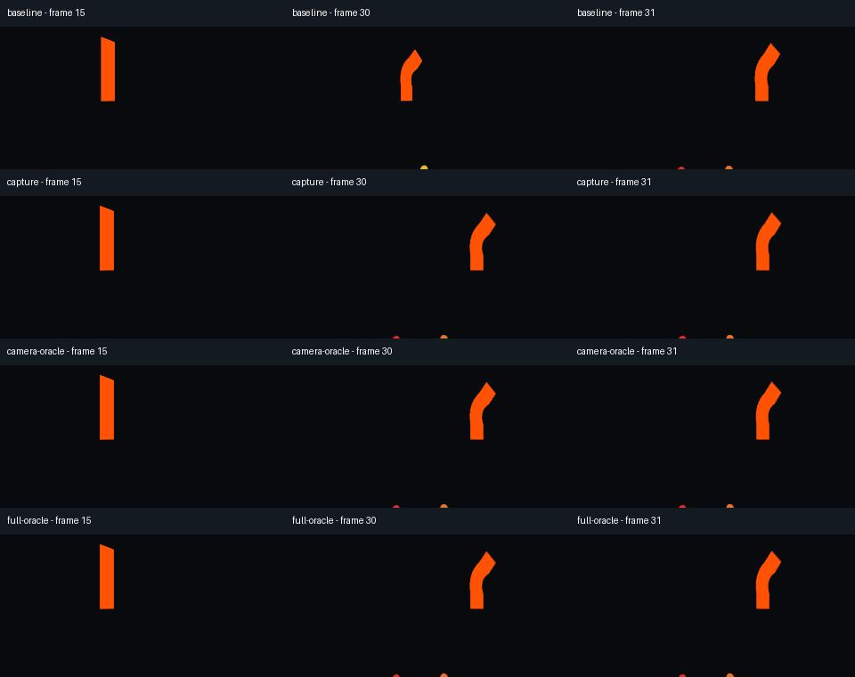

# Keeping a bone-attached camera on time

The capture camera now follows a keyed BoneAttachment3D in the same frame as the
skinned mesh. Earlier internal builds copied the viewpoint before Godot applied
its deferred attachment update, leaving camera movement and cuts one frame late.



*The middle column is the cut at frame 30. The old viewpoint is visibly late;
the corrected capture matches the reference. Each panel is the same perspective
extracted from a retained panorama, without image correction.*

## What changed

Timeline sampling still runs at priority 1000. Camera synchronization is queued
after it, allowing the pending skeleton/attachment update to complete before the
six camera transforms are copied. Godot then flushes those transforms before
drawing. No extra animation step, skeleton evaluation, viewport or readback is
added. This follows the engine's [scene-tree update order](https://github.com/godotengine/godot/blob/4.5-stable/scene/main/scene_tree.cpp)
and [BoneAttachment3D update behavior](https://docs.godotengine.org/en/4.5/classes/class_boneattachment3d.html).

No new recipe setting is required. The authored scene, camera's local transform,
bone poses and saved jobs keep their existing meaning. A re-encode uses its saved
frames; correcting a previously delayed capture requires a new render.

## Rendered evidence

The fixture keys camera translation and a hard 31.5° viewpoint cut at one second.
An orange strip uses two weighted bones, with continuous bending across the cut.
Colored markers surround the camera. References independently calculate the
camera transform and the deformed vertices, rather than reading the captured
camera or skeleton result.

Each job delivers 60 frames at 2048×1024 and 30 FPS with a 512-pixel face core.
Every source PNG and decoded MP4 frame is compared. The default test requires a
maximum per-frame mean absolute error below 0.03 in source RGB and 0.1 in decoded
RGB, on a 0–255 scale. Source error on the visible foreground must also remain
below 0.25, with at least 200 foreground pixels, so the dark background cannot hide
a deformation error or let two empty images pass. All delivery checks must pass.

The original Forward+ camera comparison reached 0.978 source MAE, including the
late cut. The corrected comparison reaches only 0.000023 source MAE and 0.018
decoded MAE. Weighted skin versus the CPU reference reaches 0.000026 source and
0.020 decoded MAE. These small differences are rasterization/encoding tolerances,
not claims of identical hashes.

The Windows review covers Godot 4.5.1/4.6.3/4.7.2 Compatibility and Godot 4.7.2
Forward+/Mobile on an RTX 3060 Ti. Cases include zero/eight warmup frames,
0/12.5% borders, an external skeleton attachment, and Forward+ TAA. TAA compares
the two camera paths with identical native skinning, since rebuilding the CPU
reference mesh gives it different motion-vector history. See the
[validation record](validation.md) for complete counts, costs and CI evidence.

A deliberately one-frame-late skin reaches only 0.0104 whole-frame error but
2.14 foreground error, so the stronger check rejects it. Separate direct-camera
old/new runs match exactly in all 240 source and decoded frames. Their 4.4–5.7 s
capture times are too variable and short to establish a performance change.

## Support boundary

A cut changes the transform of the **selected export camera**. Making another
camera current does not select a new capture source. Temporal histories remain
active across the cut; this correction does not reset TAA or promise ghost-free
images. Inspect the cut and following frames in your own scene.

The original fixture validates a small keyed skeleton, a weighted mesh and
parent/external attachments. The subsequent [imported-character review](imported-characters.md)
adds a real GLB and independent raw-source references. IK/modifier chains, ragdolls,
nested skeleton attachments, physics interpolation, other import pipelines and
long temporal histories still need validation. Read the [authoring contract](../addons/godot360/AUTHORING.md#skeletal-animation-and-viewpoint-cuts)
before adapting an interactive scene.

## Repeat the comparison

Use a fresh destination below `.godot360` and the Python dependencies described in
[testing](testing.md):

```powershell
python tests/skeletal_review.py --godot PATH_TO_GODOT --ffmpeg PATH_TO_FFMPEG --ffprobe PATH_TO_FFPROBE --output .godot360/skeletal-new --method forward_plus --driver vulkan
```

Options include `--warmup 0`, `--border 12.5`, `--external-skeleton`, and `--taa`.
`--baseline-rig PATH` inserts an extra export using a saved older rig; that
comparison is reported separately and is expected to fail against the oracle.
The reviewer writes all logs, `skeletal-review.json`, frames, videos and the
unaltered `comparison.jpg` sheet. Headless package checks independently detect
the old timing error for parent and external attachments over 63 sampled frames.
