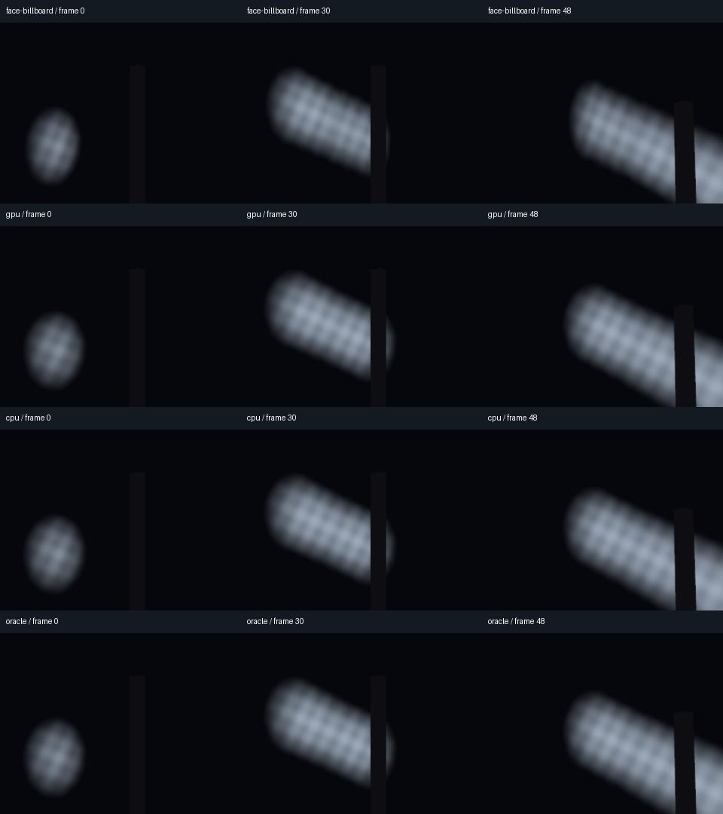

# Moving billboard smoke

The controlled smoke fixture extends the opaque-particle review with continuous
emission, overlapping transparent quads, moving emitters, recycling particles,
opaque occluders, local/world coordinates, pausing and a camera cut.



*Mobile with 12.5% capture borders, frames 0, 30 and 48. The flat view looks across
the front/right cube edge. All images come from actual retained exports.*

The sample material is
[`spherical_smoke.gdshader`](../addons/godot360/examples/spherical_smoke.gdshader).
It faces each particle toward the camera **position**, using world up for roll.
All six capture cameras share that position, so each quad keeps the same world
orientation across cube faces. This is an authored material choice. Capture does
not replace existing materials or change particle simulation settings.

## Why ordinary billboards need review

A conventional screen-aligned billboard uses the current view's basis. Adjacent
cube cameras have different bases, so the two halves of one particle can have
different orientations. Extra capture borders do not make those bases agree.
The comparison uses a control with the same smoke fragment shader and a face
camera basis, isolating orientation from opacity or texture changes.

Saved-scene notes and runtime reports now flag native BaseMaterial3D particle
billboards, including additional GPU draw passes, material overrides, overlays
and next passes. Custom shader behavior cannot be inferred by this inspection.

## Authored setup

Assign a ShaderMaterial using the sample shader to a QuadMesh on either
CPUParticles3D or GPUParticles3D. Leave `point_billboard` enabled. Set `smoke_color`
to the desired tint and opacity. The shader uses a procedural, asymmetric soft
density mask so rotations remain visible in the test. It is unlit, alpha blended,
double sided, depth tested and does not write transparent depth.

Use `local_coords = false` for smoke that stays behind a moving emitter, or true
for an effect that follows it. The fixture uses four moving emitters, each with
12 particles, a 2.137-second lifetime, upward velocity 0.7, no spread/randomness,
unit scale, zero particle rotation and conservative explicit visibility bounds.
Two streams cross horizontal cube edges; two also cross upper face boundaries.
The camera translates, yaws, pitches and rolls at delivered frame 36.

Particle Fixed FPS is zero, fractional delta is off and GPU interpolation is
off. GPU seeds are fixed. Use at least two capture warmup frames and inspect the
opening; the reviewer also compares eight-frame warmup. Warmup holds ordinary
scene processing and does not mature the plume. Emitter preprocessing, arbitrary
particle rates/interpolation and authored pre-roll need separate references.
The zero-warmup GPU opening fails on Compatibility in this matrix. Forward+/Mobile
zero-warmup observations pass this particular fixture; that does not expand the
general startup contract.

For a controlled pause, disable the scene from its parent `_process` before its
particle children run. The capture sampling hook runs later. A pause applied
there can occur after CPU simulation but before GPU simulation for that frame;
the two types then stop one sample apart. The fixture's early pause at frame 24
freezes both types, and the selected camera still cuts at frame 36.

## References and limits

The oracle uses ordinary MeshInstance3D quads. It computes particle birth frames,
spawn positions, age, local/world motion and world orientation analytically,
without reading particle buffers or copying rendered particle positions. Every
retained source frame and decoded MP4 frame is compared. Foreground errors reject
missing smoke even when most of the spherical picture is dark. Wrong position,
opacity and orientation controls must fail the same acceptance thresholds.
Actual six-camera transforms are checked after every draw, including warmup and
the paused camera cut. Process deltas, tick counts, frozen images and unchanged
authored emitter settings are also checked.

Birth times deliberately fall between export samples. An initial 2-second
lifetime/12-particle test put births exactly on sample boundaries; CPU and GPU
phase accumulation sometimes emitted on different frames. This is a native
simulation precision boundary, not corrected by changing the capture clock or
silently changing the scene's emission rate. Those exploratory failures are kept
separately from accepted evidence.

This establishes uniform-tint overlapping smoke and depth interaction with opaque
objects. Different particle colors, intersecting transparent materials and
view-depth sorting can still produce order-dependent differences. Lit smoke,
flipbooks, collisions, subemitters, turbulence, nonuniform/mirrored transforms,
camera-coincident particles, pole-aligned world-up transitions, temporal AA and
long effect histories remain outside this fixture. Point-facing billboards also
change the authored appearance from screen-aligned billboards; review the result.

## Reproduce

With NumPy/Pillow, a graphics backend and fresh output directory:

```sh
python tests/smoke_review.py --godot /path/to/godot --ffmpeg /path/to/ffmpeg --ffprobe /path/to/ffprobe --output /path/to/fresh-review --method forward_plus --driver vulkan
```

Use `--method gl_compatibility --driver opengl3` or
`--method mobile --driver vulkan --border 12.5`. The full run makes 16 clips,
each 72 frames at 2048×1024/30 FPS. It includes two zero-warmup observations;
their appearance is recorded separately from acceptance. `--cases` selects a
focused subset, and `--analyze` checks retained exports again. A subset is not
evidence of the complete matrix. Reports include source hashes and actual backend
and adapter information.

See [validation](validation.md) for measured results and
[particle startup](particle-capture.md) for the fixed capture clock and automatic
CPU bounds. Godot documents the native
[billboard modes](https://docs.godotengine.org/en/4.5/classes/class_basematerial3d.html#enum-basematerial3d-billboardmode)
and [particle simulation settings](https://docs.godotengine.org/en/4.5/classes/class_gpuparticles3d.html).
