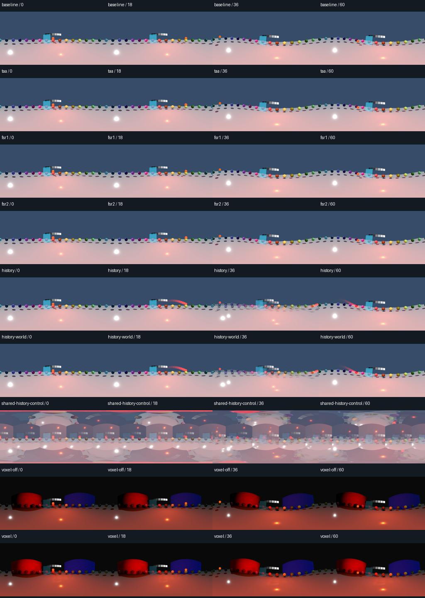
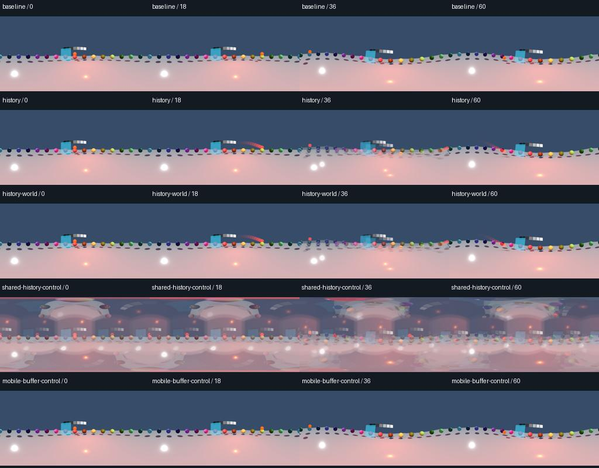

# Temporal effects, compositor history and VoxelGI

`tests/temporal_review.py` exercises an orbiting object, changing occlusion and a
camera cut through the actual PNG/MP4 export pipeline. It compares every delivered
frame with simultaneous native perspective references. The references share the
scene simulation, but own their cameras, viewports and compositor resources.

## Native results — 2026-09-10

Windows 11 / RTX 3060 Ti / Godot 4.7.2 / Vulkan passes:

| Method | Settings and cases | Result |
| --- | --- | --- |
| Forward+ | Eight warmup frames; zero border; baseline, TAA, FSR1/FSR2, camera/world history, shared-history control, VoxelGI off/on | Eight accepted clips; incorrect shared history rejected |
| Forward+ | Same nine cases with 12.5% borders | Eight accepted clips; incorrect shared history rejected |
| Mobile | Eight warmup frames, 12.5% borders, authored 4x MSAA; baseline, camera/world history and shared-history control | Three accepted clips; incorrect shared history rejected |
| Mobile failure control | Direct compute write to the native color buffer, MSAA disabled | Failed capture diagnosed before encoding; no final video or re-encode eligibility |

The 22 completed clips contain **1,584 source frames and 1,584 decoded delivery
frames**, including three intentionally corrupted controls. Nineteen clips meet
acceptance. The additional graphics-error job writes its requested 80 frames
including warmup, but is correctly rejected before encoding. Maximum accepted
native-face mean error is 0.0484 RGB levels, independent panorama mean error is
0.0560, and decoded RMS error is 1.373. Original thresholds are unchanged.
Every enabled feature differs from its disabled baseline; delayed references
are rejected. Diagonal-view differences remain observations, not seam guarantees.



*Rows are complete spherical frames at delivered indices 0, 18, 36 and 60.
The shared-history row is deliberately incorrect. The lower two rows isolate
the visible contribution from baked VoxelGI.*



*The last row contains retained images from the failed job, not a delivery file.
The [bordered Forward+ sheet](media/temporal-border.jpg) is also retained.*

The exact 221-member package passes **3,208 regression checks**: 1,158 in the
full Godot 4.7.2 Compatibility workflow and 1,025 each in the 4.5.1/4.6.3
headless/failure suites. The package is reproducible and its payload is unchanged.
See [validation](validation.md) for the hash and source-to-evidence audit.
The Temporal rendering workflow passes local actionlint; the latest hosted
checkpoint status is recorded in [validation](validation.md). This is private
development on the 0.8.0 baseline.

## What the review establishes

The fixture covers a baseline, TAA, FSR1/FSR2 at 67% internal resolution, a
camera-owned and a world-owned persistent afterimage compositor, and a small
baked VoxelGI scene with an otherwise identical disabled control. The deliberately
incorrect shared-history compositor must fail the image comparison. A one-frame
delay in the native reference must also be detected in each clip.

Each job delivers 72 frames at 1024×512 / 30 FPS from 256-pixel cube cores.
The default eight warmup draws repeat the opening pose. The moving sphere crosses
the side faces and rear seam; frame 36 cuts the camera position and rotation.
The reviewer records all six camera transforms and viewport settings on every
draw, including warmup. A render-thread probe records actual internal resolution,
upscaling mode and TAA state, so requested settings alone cannot pass acceptance.

Six independent face-aligned native views check effect preservation. A seventh,
60-degree perspective view straddles the front/right cube edge. Its image
differences are reported separately as observations of view-dependent appearance;
they are not a claim that separate temporal histories form one seamless view.

For each frame, acceptance requires native/captured face mean error below 0.15
and 99th-percentile error at most two RGB levels on the 0–255 scale. An independent
CPU projection assembles the native views: source panorama mean error must be
below 0.2, with 99th percentile at most two levels. Both the delivery and an
independently encoded reference are fully decoded; per-frame RMS error must be
below two levels. Feature-enabled clips must visibly differ from their disabled
baseline. All thirteen delivery checks, frame counts, draw timing, camera poses,
actual buffer settings and source preservation must pass too.

## Authoring guidance and limits

- TAA/FSR2 keep separate histories for each view. Test moving silhouettes,
  disocclusions and camera cuts; captured native artifacts can still be visible.
  Warmup settles the opening pose, not a simulated pre-roll.
- A compositor resource is shared by the six capture cameras. Keep persistent
  textures in each `RenderSceneBuffersRD` context; each viewport owns its buffers.
  The fixture's correct implementation uses that storage, while its failing
  control deliberately shares a texture between views. The afterimage is a
  bounded example, not certification of arbitrary third-party compositors.
- The Mobile fixture authors 4x MSAA: its resolved color attachment allows sampling
  and copying to it but lacks compute storage usage. Without MSAA it also lacks
  the required copy-destination flag. The fixture uses a writable working texture
  per view, reads through a sampler and copies back afterward. The exporter preserves these authored settings; extra
  storage/copy costs still need production profiling. A direct-write control must
  fail through the pipeline's graphics-error diagnostic before encoding, with no
  final MP4 and no re-encode recovery offered for the failed capture.
- Use renderer-supported features. TAA/FSR2 and VoxelGI coverage is evaluated on
  Forward+; Mobile has a separate compositor review. Enabling unsupported
  renderer flags does not establish feature support.
- The VoxelGI case checks a small shared world with baked static geometry and a
  moving dynamic object. It does not cover all probe layouts or convergence
  histories. The separate [saved LightmapGI review](lightmap-capture.md) now covers a small
  baked room and moving probe receiver.
- These short 1K exports do not establish heavy 4K/8K memory or endurance budgets,
  native Mac/Linux GPU coverage, or a complete 1.0 release.

See Godot's [resolution-scaling guide](https://docs.godotengine.org/en/stable/tutorials/3d/resolution_scaling.html),
[per-viewport render buffers](https://docs.godotengine.org/en/stable/classes/class_renderscenebuffersrd.html),
[compositor contract](https://docs.godotengine.org/en/stable/tutorials/rendering/compositor.html)
and [VoxelGI baking API](https://docs.godotengine.org/en/stable/classes/class_voxelgi.html).

## Reproduce

Use Godot, FFmpeg/FFprobe, NumPy and Pillow from the [developer setup](testing.md).
Run from source or an unpacked addon ZIP, with a fresh output directory:

```sh
python tests/temporal_review.py --godot PATH_TO_GODOT --ffmpeg PATH_TO_FFMPEG --ffprobe PATH_TO_FFPROBE --output .godot360/temporal-new
```

Use `--border 12.5` for expanded faces. For Mobile, use
`--method mobile --cases baseline,history,history-world,shared-history-control,mobile-buffer-control`.
`--warmup` accepts zero through ten frames; a changed value requires its own
review. `--analyze` recomputes measurements of a completed review and checks the
captured source hashes; it does not replace rendering or regenerate its oracle.
Output includes per-frame JSON measurements, PNG/native references, fully decoded
MP4 evidence, logs and a comparison sheet. Reports identify the exact tested source.

[Release readiness](release-readiness.md) · [Renderer limits](../addons/godot360/RENDERERS.md)
