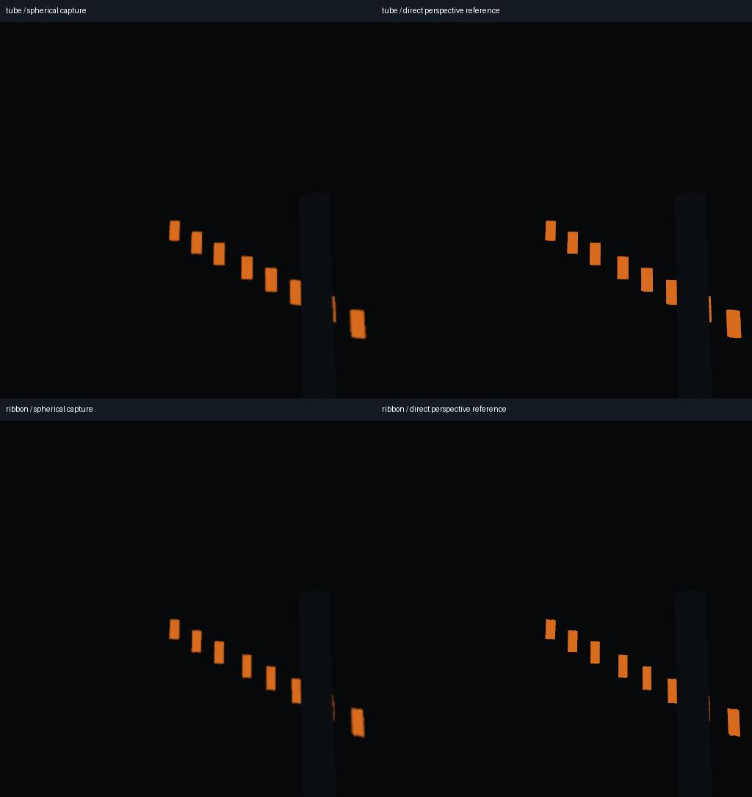

# Native particle trails

The next fixture adds native **TubeTrailMesh** and cross-shaped
**RibbonTrailMesh** to the moving GPU emitter scene. These are skinned particle
trails, distinct from the chain of transparent smoke quads in the
[smoke review](smoke-capture.md).



*Forward+ on Windows / RTX 3060 Ti, delivered frame 48. Left: a flat view sampled
from the exported sphere. Right: the simultaneous native perspective reference.
The small orange segments retain each particle's recent upward motion; the full
emitter path is the chain of separately emitted particles.*

## Settings and support

Use **Forward+ or Mobile** for native GPUParticles3D trails. Compatibility does
not implement trail history. In the measured Compatibility run, enabling trails
produced exactly the same spherical frames as disabling them, and Godot logged
its unsupported-feature warnings. Saved-scene notes now explain the requirement;
Compatibility capture reports include it too. Renderer selection and authored
particle settings remain unchanged.

Enable `trail_enabled` on GPUParticles3D and `use_particle_trails` on its
BaseMaterial3D draw material. The fixture uses Fixed FPS 30 at 30 FPS export,
interpolation off, a 0.4-second trail lifetime, six sections and three subdivisions
per section. Tubes have radius 0.06 and eight radial steps. Cross ribbons have
width 0.12. Material is opaque, unlit and double sided. Explicit bounds cover the
whole effect. CPU particles do not supply this native trail-skinning feature.
The smoke shader is not a material for skinned trails.

The run includes startup with two warmup frames, continuing emission and recycling,
moving emitters, opaque occlusion, an early parent-process pause at frame 24 and
a translated/rotated camera cut at frame 36. Paused emitter simulation and the
visible trail image stay frozen around the cut. Long trails, curved/turbulent
motion, transparent/point-facing ribbons, arbitrary fixed rates, preprocessing,
collisions and subemitters are separate cases.

## What the comparison establishes

A 512×512, 60-degree perspective camera looks diagonally across the front/right
cube boundary in the same World3D, during the same draw. Its image is saved
directly. The reviewer independently computes pinhole rays and samples the
equirectangular export into the same view. This establishes capture agreement
with native trail appearance across that boundary. It **does not independently
validate Godot's trail simulation**, and it does not inspect every direction as
the smoke oracle does.

The two rasterizations have different subpixel coverage at hard silhouettes.
At 2K, comparison requires source RGB MAE below 1, orange coverage area within
10%, centroid error below 1.5 pixels and nonempty reference geometry. The measured
source maximum is 0.322, area ratios stay within those limits and maximum centroid
error is 1.326 pixels across the three renderer datasets. Native source images use
sRGB; the direct sequence is encoded with the delivery pipeline's SDR BT.709
conversion before decoded comparison (MAE below 1.2). Comparing unconverted sRGB
pixels to BT.709 decoded pixels would conflate transfer conversion with capture.

Every delivered and direct-reference frame is checked. Comparing against a
one-frame-delayed direct sequence rejects the wrong timing at the cut, with
centroid errors above 150 pixels. The enabled/disabled pair independently requires
a visible trail effect on Forward+/Mobile and exact equality on Compatibility.
The usual process-delta, tick, settings-preservation, six-camera and frozen-image
checks also run. Thus a successful Compatibility report records an expected
unsupported feature, not a passing trail-support claim.

## Reproduce

```sh
python tests/trail_review.py --godot /path/to/godot --ffmpeg /path/to/ffmpeg --ffprobe /path/to/ffprobe --output /path/to/fresh-review --method forward_plus --driver vulkan
```

Use `--method mobile --border 12.5` or
`--method gl_compatibility --driver opengl3`. Each method produces four
2048×1024/30 FPS exports of 72 frames and their native reference images/clips.
`--analyze` rechecks retained data. NumPy, Pillow and a graphics backend are required.

Godot documents the [native trail system](https://docs.godotengine.org/en/4.5/classes/class_gpuparticles3d.html#class-gpuparticles3d-property-trail-enabled),
[TubeTrailMesh](https://docs.godotengine.org/en/4.5/classes/class_tubetrailmesh.html)
and [RibbonTrailMesh](https://docs.godotengine.org/en/4.5/classes/class_ribbontrailmesh.html).
See [validation](validation.md) for exact local evidence and remaining release work.
