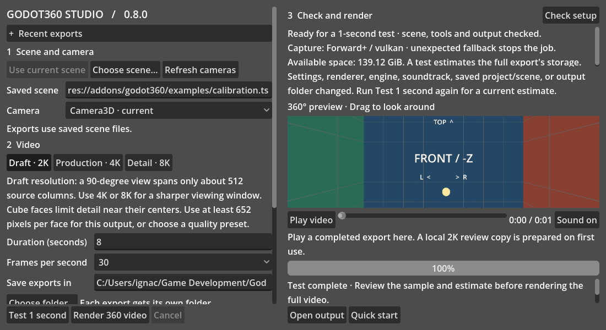
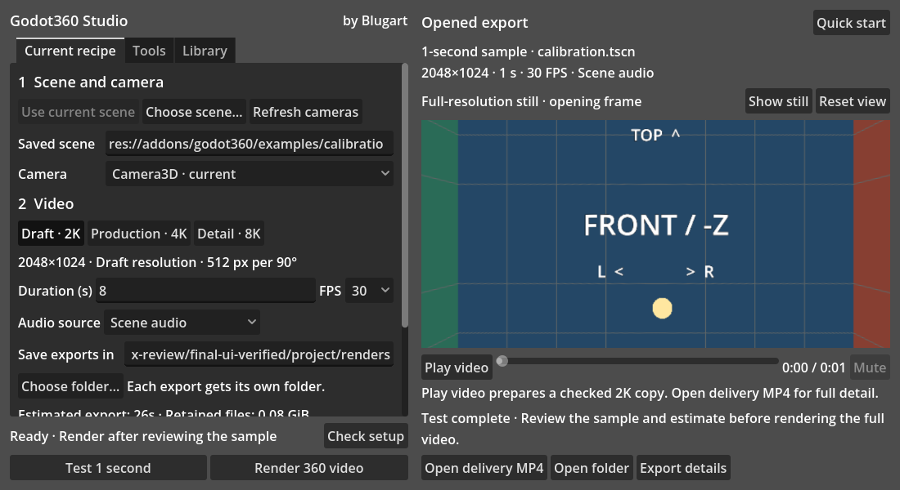
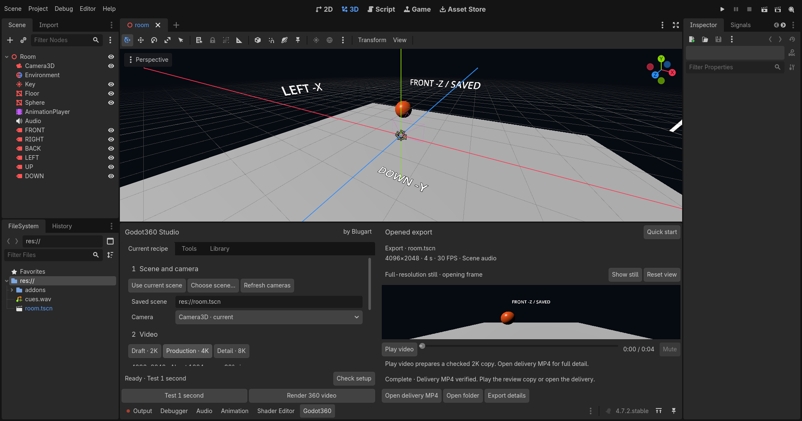

# Godot360 Studio UI/UX review

Implemented on 2026-09-12–13, retaining the private **0.8.0** development version
and author **Blugart**. This review covers the editor addon, not the demo films.
The existing uncommitted playback-decoding fix was preserved and extended.

## Findings, ordered by user impact

| Priority | Finding | Implemented result |
| --- | --- | --- |
| P1 | A one-second sample or reopened export could appear to have the scene/duration/audio of the editable recipe. Setup advice competed with completion. | Current recipe and Opened export are separate. Saved scene, dimensions, actual duration, FPS and audio remain visible. Setup/recipe errors no longer overwrite the previous export's completion. Invalid Open uses its own dialog. |
| P1 | Explicit automatic discovery could replace the selected FFmpeg pair; selecting FFmpeg always replaced FFprobe. This could restore the faulty walkthrough build. | Find missing tools fills only empty/default fields. Deliberate paths, including offline paths, survive discovery, file selection and restart. Clearing a field permits discovery. Selected files save immediately; tool versions and separate delivery/playback capabilities are visible. |
| P1 | Playback failure looked like a delivery failure and long log paths dominated the preview. | Full decoding still rejects corrupt copies. The message identifies encode/format/decode preparation failure; Tool setup, Playback logs and Retry playback provide the next steps. Verified delivery actions remain available. |
| P1 | Cancelling could be replaced by the next ordinary progress poll. | Cancellation remains visible while the worker stops; the request button disables after submission. Existing retention and coordinator acknowledgement protocols remain intact. |
| P2 | Repeated explanations and multiple preview scrollbars crowded the dock. | Three native tabs—Current recipe, Tools, Library—with one settings scroll per page. Check/Test/Render stay together. The preview has no nested scrolling; complete status and scene notes are in Export details. Basic scene, video, audio and destination controls fit the 1100×600 ready view. |
| P2 | Still, playback copy and delivery were easy to confuse, with no explicit return to the full-resolution still. | The image header identifies its source. Show still pauses video and restores the opening frame; Play video restores the video texture. Open delivery MP4 and Open folder have distinct purposes. |
| P2 | Sphere navigation required a mouse; long paths and disabled-looking diagnostic text reduced usability. | Tab focus, a visible sphere focus border, arrow-key look, Home/Reset view, native slider keyboard input, selectable paths and readable read-only details. Native control theme and focus styles remain in use. |
| P2 | Recent exports printed long paths inline and could omit duration on real jobs, which store frame count instead. | Compact metadata includes derived duration. A selectable path field and tooltip preserve full location access without expanding the page. |
| P3 | Help, recovery and examples were mixed into everyday settings; branding was visually heavy. | Library groups recent exports, recipes/examples and recovery. Quick start stays above review. Product name remains Godot360 Studio, with discreet “by Blugart” attribution and development version in its tooltip. |

The design keeps Godot's own controls, theme, sizing and keyboard behavior. It
does not introduce a web surface, custom icon system or promotional links.

## Before and after

These are unmodified native Godot viewport captures. Both compact views use a
1100×600 window, the included calibration scene, a Draft recipe and a completed
one-second sample. The editable duration is eight seconds. The before snapshot
includes the owner's existing uncommitted playback fix.

**Before:** export metadata is absent; readiness, estimates, playback and status
compete for preview space, with several independent scroll areas.

**After:** the one-second sample is named separately, the image source is clear,
and current-recipe actions remain together.

The comparable ready-state preview grows from approximately 170 to 332 logical
pixels high. This is a geometric observation in the captured 1100×600 fixture,
not a performance claim. In short native editor docks the preview retains a
130-pixel minimum; dragging the dock taller provides more review space.

## Journey review and evidence

| Journey | Evidence and behavior |
| --- | --- |
| Install and enable | Native integration installs the packaged addon in a fresh project, enables it and finds one Godot360 bottom panel. Quick start explains the folder, Plugins setting and dock location. Enabling is automated configuration, not a mouse-navigation review. |
| Choose tools | Real versions, required encoders/filters, missing tools, wrong executable, deliberate/offline selections, sibling discovery and persistence tested. [Tools view](media/ui-tools-1100.png). |
| Scene/camera | Saved, current, unnamed, inherited, instanced, ambiguous and runtime camera workflows tested; real editor scene saving exercised. Source scene remains unchanged by recovery. [Empty view](media/ui-empty-1100.png). |
| Video/audio/output | Presets, custom validation, FPS, soundtrack visibility, offsets/gain contracts, writable/invalid destinations and stale estimates covered. [Ready view](media/ui-ready-1100.png). |
| Sample/export/cancel | Real 2K UI sample and 4K editor sample/export; stage counts, cancellation and terminal states checked. [Running](media/ui-running-1100.png), [cancelling](media/ui-cancelling-1100.png), [cancelled](media/ui-cancelled-1100.png). |
| Review/delivery | Still/video switching, focused keyboard sphere, native play/pause/replay/seek, stereo mix bus, verified delivery action and unchanged MP4 hashes. [Expanded view](media/ui-completed-1440.png). |
| Reopen/re-encode/recover | Two editor processes, history, retained-frame re-encode, actual capture/encode cancellation, recovery and diagnostics. Real recent-job duration now derives from frames/FPS. [Library](media/ui-library-1100.png). |
| Failure guidance | Actual malformed playback packets are rejected by the playback suite. [Playback error screenshot](media/ui-playback-failed-1100.png) is a controlled presentation state after a successful copy; [failed export](media/ui-export-failed-1100.png) uses deliberately failed saved metadata. Neither image is evidence that the sample delivery failed. |
| Advanced/help | Settings and examples remain reachable through native tabs/foldouts; full scene warnings and paths are selectable in [Export details](media/ui-details-1100.png). Documentation describes re-encode source settings separately from current quality/audio. |

## Validation and limits

The accepted evidence is recorded in [validation](validation.md#studio-uiux-audit--2026-09-13)
and the [media provenance](media/ui-provenance.json). Local runs and development
attempts are retained under `.godot360/ui-ux-review/`. The new `tests/ui_review.py`
prepares an isolated project, rejects engine errors, and records source hashes.
It exercises the actual addon and produces the state screenshots; it does not
touch the owner's settings or render masters.

Windows / Godot 4.7.2 / Forward+ Vulkan / RTX 3060 Ti is the native environment.
Default control-theme screenshots cover 1100×600, 1440×900 and a 125% window-scale
fixture; the native editor integration covers its inherited dark editor theme
and ordinary compact bottom dock. The review inspects pixels and automated
control actions. It is **not human click-through acceptance**, subjective
listening, full assistive-technology certification, a light-theme review, or
native macOS/Linux GPU validation. Window scaling does not establish every Godot
editor display-scale/OS combination. Those release limits remain explicit.

No capture projection, rendering, encoder settings, audio mixing, metadata,
storage guard or recovery protocol was changed. Existing full-copy decoding,
cache invalidation, log retention and source-preservation tests remain active.
No public release, visibility change or version bump was performed.

## Blugart's short verification walkthrough

1. Restart the editor or disable/re-enable the addon. Open Godot360 and expand
   the bottom dock. In Tools, verify the displayed selected paths/versions.
   Click Find missing tools and confirm your selected pair remains unchanged.
2. Use your current saved scene, pick its camera, select Production · 4K,
   four seconds and scene audio. Choose the output folder, Check setup and
   Test 1 second. Confirm the left duration stays four and the right says one.
3. Drag the sphere; Tab to it and try arrows/Home. Play the copy, pause, seek,
   mute/unmute and Show still. Play again, then Open delivery MP4 and Open folder.
4. Render the four-second clip. Change the next recipe while it runs; confirm
   the opened job retains its saved settings. Review the full clip and its notes.
5. Restart, reopen it from Library, and re-encode the retained capture. Check the
   new output and unchanged original. Start a longer capture and cancel it;
   use Export details and the recovery guide to inspect the retained failure state.

For a clean installation walkthrough without this repository's settings, use
`tests/prepare_walkthrough.py` with the reviewed package and a fresh output folder.
Its existing command is documented in [editor workflow](editor-workflow.md).
