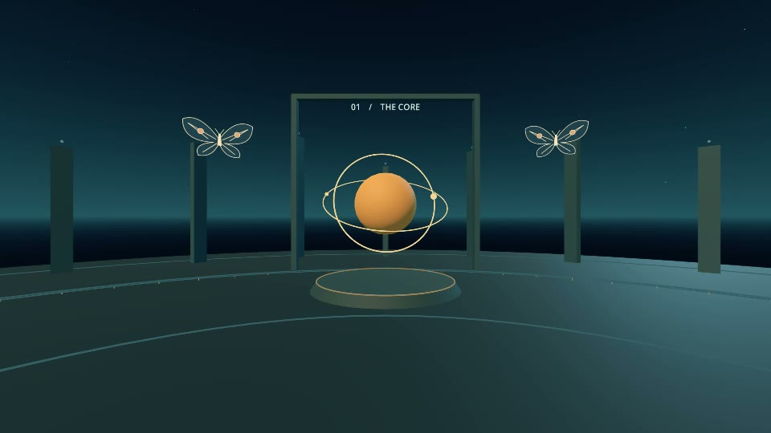

# UMBRAL interactive installation

A small world of gaze-driven discoveries, with an authored **12-second film**
recipe for 360° export.

[](https://www.youtube.com/watch?v=zWUyKH0Q31I)

**[Watch in 360° on YouTube · 12 s, silent ↗](https://www.youtube.com/watch?v=zWUyKH0Q31I)**
· [All four films](https://www.youtube.com/playlist?list=PLUjBgihWYNpQ)

*A perspective view from the exported film. In Godot, looking at objects triggers
their reactions; the video follows a prepared sequence.*
[See how interactive scenes become films](showcase.md#an-interactive-scene-prepared-for-film)
· [Export your first scene](../addons/godot360/QUICKSTART.md)

## Play the interactive installation

Press **F5**, or open `scenes/Main.tscn` and press **F6**.

| Control | Action |
| --- | --- |
| Mouse | Look around, with smoothing and pitch limited to ±85° |
| Esc | Release/capture the mouse |
| Click with mouse released | Capture the mouse |
| R | Smoothly recenter |
| F3 | Toggle FPS, target name, and gaze duration |

Mouse sensitivity is exposed on `Player` in degrees per pixel. Smoothing and pitch
limits are also configurable. Releasing the mouse or losing focus cancels gaze
interaction while environmental animation continues. Restart to reset discoveries.

- **Front — The core:** appears at 2 seconds. A one-second gaze changes its
  appearance and animation, once per playthrough.
- **Right — The echo:** sends a cue at 5 seconds. Look away and back to repeat its pulse.
- **Behind — The reverse:** a light trail appears at 8 seconds. Gaze opens and
  raises the bloom with its collision shape.
- **Left — The witness:** moves along an arc while the camera points at the core,
  then stops when you look elsewhere. Its reaction depends on whether it has moved.
- **Above:** an animated orbital mobile; original SVG cutouts decorate the space.

The crosshair shows dwell progress. There are four discoveries, and exploration
can continue after finding them all. These interactions belong to Godot. A YouTube
video cannot execute the gaze logic: its events happen at the same time for everyone.

## Scene architecture

```text
scenes/Main.tscn
├── World
│   ├── Environment             Procedural sky or a panorama texture
│   ├── Props                   Floor, arches, sprites, and ceiling mobile
│   └── GazeTargets             Four independently instanced targets
├── Player
│   ├── Camera3D
│   └── GazeDetector
├── SequenceController
└── UI/HUD
```

| File | Responsibility |
| --- | --- |
| `scripts/player_look.gd` | Mouse input, capture, smoothing, recentering |
| `scripts/gaze_detector.gd` | Physics ray, target changes, dwell timer |
| `scripts/gaze_target.gd` | Reusable target properties and interaction signals |
| `scripts/props/*.gd` | Target behavior and Tween animation |
| `scripts/sequence_controller.gd` | Timed cues at 2, 5, and 8 seconds |
| `scripts/main.gd` | Narrative wiring, discovery count, optional film hooks |
| `scripts/ui/*.gd` | Crosshair, messages, compass, debugging |
| `scripts/world/*.gd` | Background and generated geometry |
| `addons/godot360/` | Independent export tool, calibration scene, and preview |

Decorative meshes are generated in `_ready()`, so they appear when running the
scene. Gaze targets and their collision shapes are edited in their `.tscn` scenes.
The film hook disables live gaze, awakens the core at 3.5 s, pulses the echo at 6 s,
opens the rear bloom at 9 s, and moves the witness along a scripted arc. It also
orients cutouts toward the shared capture origin instead of per-camera billboards.

## Add a gaze target

1. Create an `Area3D` scene using `scripts/gaze_target.gd`.
2. Set collision layer 2 and collision mask 0, then add a suitable `CollisionShape3D`.
3. Add a visual node and instance the scene under `World/GazeTargets`.
4. Set `display_name`, `dwell_time`, `accent_color`, `enabled`, and `activate_once`.
5. Connect `gaze_activated` to its behavior. `gaze_entered` and `gaze_exited` are
   also available; all three signals have no arguments.

With `activate_once = false`, a target activates once per visit: look away to rearm
it. `reset_activation()` clears the completed state. Looking away, disabling or
removing a target, or releasing input resets detection. The four-discovery narrative
in `main.gd` is specific to this demo; adapt it when adding targets.

The detector queries layers 1 and 2. Occluding objects require a `StaticBody3D` and
collision on layer 1. A visual mesh alone does not block a physics ray.

## Use a panorama background

Copy a 2:1 equirectangular image into `assets/panoramas/`, select
`World/Environment`, and assign **Panorama Texture**. Adjust **Panorama Rotation
Degrees** to align it. Leaving the texture empty restores the procedural sky.
This is a static spherical background, with no video playback or positional parallax.
